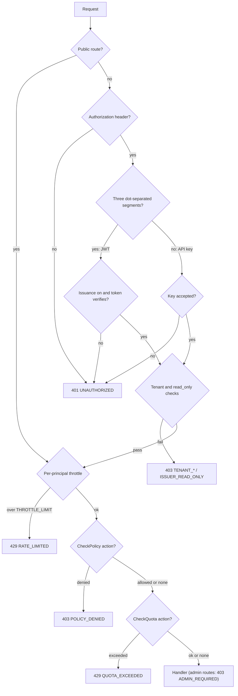

# ACDP Control Plane — API Reference

Base URL: `http://localhost:3001` (dev; `PORT`, default `3001`). Swagger UI is
served at `/docs` (`SWAGGER_PATH`, default `docs`) — on by default only when
`NODE_ENV=development`, opt-in elsewhere with `SWAGGER_ENABLED=true`.

Normative protocol text (RFCs, registries, JSON schemas) lives in the spec repo;
this page documents what the **control plane's own routes** accept and return.
Links to the spec are pinned to the commit CI tests against — see the
[Sibling docs](./README.md#sibling-docs) index.

## Authentication

Every route not marked **Public** requires an `Authorization` header. The value
is `Bearer <credential>` (a bare `<credential>` without the `Bearer ` prefix is
also accepted). A missing or empty header is `401 UNAUTHORIZED`.

The guard dispatches on the credential's shape, with no fallback between the two:

- **Bearer JWT** — any value with exactly three dot-separated segments. Accepted
  only when `TOKEN_ISSUANCE_ENABLED=true`; otherwise every JWT is `401`. Verified
  as either a token this CP issued via `/auth/token` or one from a trusted
  external issuer (`TRUSTED_ISSUERS`). A trusted issuer flagged `read_only` is
  limited to GET/HEAD/OPTIONS (`403 ISSUER_READ_ONLY`; `POST /auth/introspect`
  is exempt). **A JWT is never an admin credential** — local or federated.
- **API key** — anything else, matched (constant-time) against `AUTH_API_KEYS`.
  An unknown key is `401`.

**Admin** routes need an API key listed in **both** `AUTH_API_KEYS` and
`AUTH_ADMIN_API_KEYS`; any other caller gets `403 ADMIN_REQUIRED`.

**Development bypass.** When `AUTH_API_KEYS` is empty, any non-JWT credential is
accepted as the `default` tenant — but the `Authorization` header must still be
present, and the caller is never admin (admin routes still `403`). Startup fails
with an empty `AUTH_API_KEYS` unless `NODE_ENV=development` — note that an
**unset** `NODE_ENV` counts as `development`. With `AUTH_REQUIRE_TENANT=true` the
bypass is replaced by `403 TENANT_REQUIRED`.

`TOKEN_ISSUANCE_ENABLED=true` also **mounts** the IdP routes — `/auth/challenge`,
`/auth/token`, `/auth/introspect`, `/auth/token/revoke`, `/auth/revocations` and
`/.well-known/jwks.json`. With it off they do not exist (`404 NOT_FOUND`).
`/admin/pinned-keys/reload` is mounted either way. Full flows:
[AUTH.md](./AUTH.md).

### Tenancy headers

All tenant-owned reads and writes are scoped to the caller's resolved tenant.
How `X-Tenant-Id` is treated depends on the credential:

| Credential | Tenant | `X-Tenant-Id` |
|------------|--------|---------------|
| JWT with a `tenant` claim | the claim | must equal the claim, else `403 TENANT_MISMATCH` |
| JWT without a `tenant` claim | header if `TENANT_HEADER_TRUST=any_peer`, else `default` | `403 TENANT_HEADER_UNTRUSTED` unless `TENANT_HEADER_TRUST=any_peer` |
| API key bound in `TENANT_API_KEYS` | the binding | must equal the binding, else `403 TENANT_MISMATCH` |
| Unbound API key | `default` | **ignored** |

On every authenticated path (the empty-`AUTH_API_KEYS` development bypass never inspects the header), explicitly asserting the reserved `default` tenant (header or
claim) is `403 TENANT_RESERVED`. With `AUTH_REQUIRE_TENANT=true`, a request that
resolves only to `default` is `403 TENANT_REQUIRED`. See
[TENANCY.md](./TENANCY.md).

### Request pipeline

Guards run in this order on every route (registration order in
`src/app.module.ts`); the first to refuse answers.



Probes (`/healthz`, `/readyz`) skip the throttle. During a shutdown drain, a
middleware answers new requests with `503 SERVICE_DRAINING` **before** any guard
runs (see below).

### Error responses

Every error (`4xx`/`5xx`) is normalized by `GlobalExceptionFilter` and sent with
`Content-Type: application/acdp+json`. The body keeps the CP's flat fields and
adds the RFC-ACDP-0007 error envelope
([§4](https://github.com/agentcontextdistributionprotocol/agentcontextdistributionprotocol/blob/34f14ab2ab454308e94fd6f137ef940db45c72c8/rfcs/RFC-ACDP-0007-capabilities.md#4-error-envelope))
alongside them:

```json
{
  "statusCode": 404,
  "errorCode": "RUN_NOT_FOUND",
  "message": "run run-001 not found",
  "error": { "code": "RUN_NOT_FOUND", "message": "run run-001 not found" }
}
```

- `errorCode` and `error.code` always carry the same value.
- When the producer attached structured detail it appears as top-level
  `metadata` **and** as `error.details`.
- A `ValidationPipe` failure (`400 INVALID_PAYLOAD`) carries `message` (and
  `error.message`) as an **array** of field messages; Nest's own string
  `error: "Bad Request"` member is replaced by the envelope object.

`errorCode` is one of the values below (`src/errors/error-codes.ts`; the set is
pinned by `src/errors/error-codes.spec.ts`, which also checks that every code
has a row in this table). Codes are SCREAMING_SNAKE so they never collide with a
registry's lowercase wire vocabulary
([RFC-ACDP-0007 §5](https://github.com/agentcontextdistributionprotocol/agentcontextdistributionprotocol/blob/34f14ab2ab454308e94fd6f137ef940db45c72c8/rfcs/RFC-ACDP-0007-capabilities.md#5-error-code-registry),
[error-code registry](https://github.com/agentcontextdistributionprotocol/agentcontextdistributionprotocol/blob/34f14ab2ab454308e94fd6f137ef940db45c72c8/registries/error-codes.md)).

**Generic fallbacks** are assigned by the filter, keyed on the real HTTP status,
when the error's producer set no code; a **specific** code is used wherever one
exists. `INTERNAL_ERROR` is reserved for genuine server faults (5xx) — it is in
RFC-ACDP-0007 §5's retryable set, so no `4xx` ever carries it (#182).

| Code | HTTP | Kind | Meaning |
|------|------|------|---------|
| `INVALID_PAYLOAD` | 400 | fallback | Request body/query failed validation or parsing (ValidationPipe, ingest checks, unsupported algorithm, malformed `ctxId`). |
| `UNAUTHORIZED` | 401 | fallback | Credentials missing or rejected: no header, unknown API key, JWT that fails verification or arrives with `TOKEN_ISSUANCE_ENABLED=false`, and the non-signature `/auth/token` / capability failures (unknown/expired nonce, agent mismatch, no pinned key, algorithm mismatch). |
| `FORBIDDEN` | 403 | specific | Authenticated but not permitted — today only `POST /auth/token/revoke` on another subject's verified token. |
| `NOT_FOUND` | 404 | fallback | No such route (including the IdP routes when `TOKEN_ISSUANCE_ENABLED=false`). |
| `PAYLOAD_TOO_LARGE` | 413 | fallback | JSON or urlencoded body over `INGEST_MAX_BODY_BYTES` — the limit applies to **every** route, rejected by the body parser before the handler. |
| `RATE_LIMITED` | 429 | fallback | Coarse per-principal throttle (`THROTTLE_LIMIT` per `THROTTLE_TTL_MS`; 20/min/IP on `/auth/challenge` and `/auth/token`). |
| `REQUEST_REJECTED` | other 4xx | fallback | Any other client error (405, 409, 415, 422, …). |
| `INTERNAL_ERROR` | 5xx | fallback | Genuine server fault; retryable. Never on a 4xx. |
| `RUN_NOT_FOUND` | 404 | specific | No such run in the caller's tenant (`GET /runs/:runId`, `POST /runs/:runId/complete`, and the cross-tenant SSE guard). |
| `REGISTRY_NOT_FOUND` | 404 | specific | Federation proxy: authority not observed in the caller's tenant (or observed without a base URL). Log witness: no witness state for the authority, or no active alert to acknowledge. Also every witness route (`/log/witness`, `/.well-known/acdp-witness.json`, `/.well-known/did.json`) when `WITNESS_COSIGNING_ENABLED=false`. |
| `AGENT_NOT_FOUND` | 404 | specific | No such agent DID in the caller's tenant. |
| `CONTEXT_NOT_FOUND` | 404 | specific | Reserved; not emitted by any route today. |
| `ADMIN_REQUIRED` | 403 | specific | Admin-only route; use a key listed in `AUTH_ADMIN_API_KEYS`. |
| `TENANT_RESERVED` | 403 | specific | The reserved `default` tenant was explicitly asserted (header, JWT claim, enrollment `tenantId`, or run-notify `X-Tenant-Id`). |
| `TENANT_MISMATCH` | 403 | specific | `X-Tenant-Id` disagrees with the JWT claim / key-bound tenant. |
| `TENANT_REQUIRED` | 403 | specific | `AUTH_REQUIRE_TENANT` and the request resolves only to `default`. |
| `POLICY_DENIED` | 403 | specific | `PolicyGuard` denied (legacy top-level `code` names the rule; `indeterminate` = could not decide). |
| `QUOTA_EXCEEDED` | 429 | specific | Per-tenant per-action `TENANT_QUOTAS` limit; see `Retry-After`. |
| `REGISTRY_NOT_ENROLLED` | 403 | specific | Ingest from an unenrolled authority under `INGEST_REQUIRE_ENROLLMENT`. |
| `REGISTRY_DISABLED` | 403 | specific | Ingest from an enrolled but disabled registry. |
| `REGISTRY_ENROLLED_ELSEWHERE` | 409 | specific | `POST /registries/enroll` for an authority already enrolled under a different tenant; the tenant binding is immutable and the enrollment is left unchanged. The body does not name the owning tenant. Not retryable. |
| `TENANT_HEADER_UNTRUSTED` | 403 | specific | A JWT with no `tenant` claim sent `X-Tenant-Id` and `TENANT_HEADER_TRUST=none` (default). Use a tenant-bound token, or set `TENANT_HEADER_TRUST=any_peer` behind an authenticating gateway. |
| `ISSUER_READ_ONLY` | 403 | specific | The bearer token is from a `TRUSTED_ISSUERS` entry flagged `read_only` and the method is not GET/HEAD/OPTIONS (`POST /auth/introspect` is exempt). Use a CP-issued token, or have the operator lift the flag. |
| `INVALID_WEBHOOK_SIGNATURE` | 401 | specific | HMAC `X-ACDP-Signature` failed on `/ingest/acdp` or the `/runs` notify routes. |
| `INVALID_SIGNATURE` | 401 | specific | The final Ed25519/ECDSA-P256 signature check failed on `POST /auth/token` or `POST /capabilities`. Every earlier rejection on those routes is a plain `401 UNAUTHORIZED`. |
| `VALIDATION_ERROR` | 400 | specific | Malformed `log_id` / `tree_size` on `GET /log/witness` (`schema_violation`). |
| `FEDERATION_UPSTREAM_RATE_LIMITED` | 503 | specific | The federated registry answered 429. |
| `SERVICE_DRAINING` | 503 | specific | This instance is shutting down; retry (honour `Retry-After`) — another replica will serve it. Transient. |
| `DEPENDENCY_UNAVAILABLE` | 503 | specific | A required backing dependency (today: Postgres) failed the readiness probe; `error.details.checks` names it. Readiness only. Transient; retry with backoff. CP-local SCREAMING_SNAKE code with no RFC-ACDP-0007 §5 mapping (that closed enum has no 503 member). |
| `FEDERATION_UPSTREAM_ERROR` | 502 | specific | No usable response from the federated registry: SSRF-refused base URL, transport/timeout failure, rejected redirect, or body over 1 MiB. |
| `CONTEXT_ID_MISMATCH` | 502 | specific | The registry served a different `ctx_id` than requested. |
| `CONTEXT_BINDING_UNVERIFIABLE` | 502 | specific | The served body's `ctx_id` could not be checked. |
| `INVALID_LOG_PROOF` | — | verdict | Transparency-log proof/checkpoint failed (audit verdict/alert category). |
| `INVALID_WITNESS_COSIGNATURE` | — | verdict | A witness cosignature failed (diagnostic category). |

`SERVICE_DRAINING` (issue #192) is returned by `GET /readyz` from the moment a
shutdown signal arrives, and by the shutdown drain gate to any request whose
headers arrive after the instance began closing (after the optional
`SHUTDOWN_DRAIN_DELAY_MS`, during which other routes still serve), before
authentication (so it costs no throttle or quota budget), with `Retry-After`
(`SHUTDOWN_RETRY_AFTER_SECONDS`, default 1), `Connection: close`, the usual
envelope, CORS headers and an `X-Request-Id`. A request whose headers arrived
*before* the drain runs to completion even if its body finishes later. A CORS
preflight is still answered `204` by the CORS layer. The two SSE routes are
exempt (see [SSE](#sse-streams)). RFC-ACDP-0007 §5's closed enum has no 503
code, so no RFC code is minted or reused.

`DEPENDENCY_UNAVAILABLE` (issue #210) is returned by `GET /readyz` while the
instance is serving but a required dependency failed its readiness probe —
Postgres refused, timed out (`READINESS_DB_TIMEOUT_MS`), or the pool could not
hand out a connection in time. It is distinct from `SERVICE_DRAINING` (this
process is leaving, not broken) and from `INTERNAL_ERROR` (the CP itself is
fine). `error.details` carries the legacy `ok: false` / `database: "unhealthy"`
keys plus `checks.database = { status: "down", reason: "error" | "timeout",
latencyMs }` — an enum reason, never the driver's error text, host or port. No
`Retry-After` (an outage has no known duration).

`INVALID_LOG_PROOF` and `INVALID_WITNESS_COSIGNATURE` are deliberately distinct
([RFC-ACDP-0015 §10](https://github.com/agentcontextdistributionprotocol/agentcontextdistributionprotocol/blob/34f14ab2ab454308e94fd6f137ef940db45c72c8/rfcs/RFC-ACDP-0015-witness-cosigning.md#10-capabilities-profile-and-errors)):
the former indicts a transparency-log proof or checkpoint, the latter a
witness's own cosignature.

Policy denials return `403 POLICY_DENIED` and keep the legacy top-level
`{ message, code, reason }`; quota exceeded returns `429 QUOTA_EXCEEDED` with the
legacy top-level `{ code: "rate_limited", tenantId, action, limit,
windowSeconds, retryAfterSeconds }` and a `Retry-After` header (see
[POLICY.md](./POLICY.md)). In both, the same fields also appear as
`error.details`.

---

## Route index

Legend — **Auth**: `Public` (no bearer), `Public (HMAC)` (body HMAC instead of a
bearer), `key/JWT` (any authenticated caller), `admin` (admin API key).
**†** = mounted only when `TOKEN_ISSUANCE_ENABLED=true`. **Gates**: the
`@CheckPolicy` / `@CheckQuota` action names (see [POLICY.md](./POLICY.md));
every route except the probes is also subject to the coarse throttle.
**OK** = success status.

| Method | Path | Auth | Gates | OK | Notes |
|--------|------|------|-------|----|-------|
| POST | `/ingest/acdp` | Public (HMAC) | quota `publish` | 204 | Registry webhook in |
| GET  | `/ingest/health` | Public | — | 200 | Registry config liveness |
| GET  | `/runs` | key/JWT | policy `run.read` | 200 | List runs |
| GET  | `/runs/:runId` | key/JWT | policy `run.read` | 200 | Run detail + `trust` |
| GET  | `/runs/:runId/lineage` | key/JWT | policy `run.read` | 200 | Lineage DAG |
| GET  | `/runs/:runId/events` | key/JWT | policy `run.read` | 200 | Run events |
| GET  | `/runs/:runId/events/stream` | key/JWT | policy `run.read` | 200 | SSE — per-run |
| POST | `/runs/started` | Public (HMAC) | — | 204 | Run-start notify (scenario attribution) |
| POST | `/runs/:runId/complete` | Public (HMAC) | — | 204 | Mark run terminal |
| GET  | `/events` | key/JWT | — | 200 | Cross-run event history |
| GET  | `/events/stream` | key/JWT | — | 200 | SSE — global feed |
| GET  | `/contexts/*ctxId` | key/JWT | policy `context.retrieve` | relayed | Federation proxy (SSRF-gated, served `ctx_id` bound) |
| GET  | `/agents` | key/JWT | — | 200 | Known agents |
| GET  | `/agents/*did` | key/JWT | — | 200 | Agent detail |
| POST | `/capabilities` | key/JWT | policy + quota `capability.declare` | 200 | Declare a signed capability |
| GET  | `/capabilities/search` | key/JWT | — | 200 | Find agents by capability |
| GET  | `/capabilities/by-agent/*did` | key/JWT | — | 200 | One agent's capabilities |
| GET  | `/registries` | key/JWT | — | 200 | Observed registries |
| GET  | `/registries/enrollments` | key/JWT | — | 200 | Enrolled registries (secrets omitted) |
| POST | `/registries/enroll` | admin | — | 201 | Enroll a registry, or update it within its tenant — PATCH-like: omitted fields kept, explicit `null` clears (`409 REGISTRY_ENROLLED_ELSEWHERE` if bound to another tenant) |
| GET  | `/registries/:authority/log-witness` | key/JWT | — | 200 | Witnessed checkpoints + alert state (RFC-ACDP-0012) |
| GET  | `/registries/log-witness/alerts` | key/JWT | — | 200 | Alerted registries worklist |
| POST | `/registries/:authority/log-witness/ack` | admin | — | 201 | Acknowledge a witness alert |
| GET  | `/dashboard/overview` | key/JWT | — | 200 | KPIs |
| POST | `/webhooks` | key/JWT | — | 201 | Create subscription |
| GET  | `/webhooks` | key/JWT | — | 200 | List |
| PATCH | `/webhooks/:id` | key/JWT | — | 200 | Update |
| DELETE | `/webhooks/:id` | key/JWT | — | 204 | Remove |
| GET  | `/domain-packs` | key/JWT | — | 200 | List active packs |
| GET  | `/routing/stats` | admin | — | 200 | Bandit router arm state |
| POST | `/auth/challenge` | Public † | 20/min/IP | 200 | Request a signing nonce |
| POST | `/auth/token` | Public † | 20/min/IP | 200 | Exchange a signed nonce for a JWT |
| POST | `/auth/introspect` | key/JWT † | — | 200 | RFC 7662 token introspection |
| POST | `/auth/token/revoke` | key/JWT † (self or admin) | — | 200 | RFC 7009 token revocation |
| GET  | `/auth/revocations` | admin † | — | 200 | Cross-issuer revocation feed |
| GET  | `/.well-known/jwks.json` | Public † | — | 200 | CP public JWKS |
| POST | `/admin/pinned-keys/reload` | admin | — | 200 | Reload pinned keys from env |
| GET  | `/log/witness` | Public | — | 200 | This witness's log cosignatures (RFC-ACDP-0015) |
| GET  | `/.well-known/acdp-witness.json` | Public | — | 200 | Witness capabilities (RFC-ACDP-0015 §9) |
| GET  | `/.well-known/did.json` | Public | — | 200 | Witness DID document |
| GET  | `/healthz` | Public | unthrottled | 200 | Liveness — never touches the DB |
| GET  | `/readyz` | Public | unthrottled | 200 | Readiness — 503 when draining or the DB is down |
| GET  | `/metrics` | Public | — | 200 | Prometheus text format |
| GET  | `/docs` | Public | — | 200 | Swagger UI (dev / `SWAGGER_ENABLED`) |

> Authoritative against `src/**/*.controller.ts` as of this writing; confirm
> there if in doubt.

---

## Ingest

### `POST /ingest/acdp` — receive a registry webhook

**Public** (no bearer); authenticated by an HMAC-SHA256 of the raw body in
`X-ACDP-Signature: sha256=<hex>`, keyed by the enrolled registry's secret or
`WEBHOOK_SECRET`. The handler also reads `X-Run-Id`, `X-Tenant-Id`,
`X-ACDP-Event-Id` and `Origin`, and is quota-gated as action `publish`.
[INGEST.md](./INGEST.md) owns the contract: which secret is used, how the
tenant and run are resolved, enrollment rules, dedup ids, the body's required
fields, and the order the checks run in.

| Status | Meaning |
|--------|---------|
| `204` | Accepted (persisted and broadcast), **or** silently deduplicated. |
| `400` | Malformed JSON, missing required fields, JSON too deep, or a domain-pack-gated `context_type`. |
| `401` | `INVALID_WEBHOOK_SIGNATURE` — bad or missing HMAC signature. |
| `403` | `REGISTRY_NOT_ENROLLED` (`INGEST_REQUIRE_ENROLLMENT=true`) or `REGISTRY_DISABLED`. |
| `413` | `PAYLOAD_TOO_LARGE` — body over `INGEST_MAX_BODY_BYTES`, rejected by the body parser before the handler. |
| `429` | `QUOTA_EXCEEDED` (`TENANT_QUOTAS`) or `RATE_LIMITED` (coarse throttle), with `Retry-After`. |

### `GET /ingest/health`

**Public**. Liveness for registry config tests. Returns `{ "ok": true }`.

---

## Runs

All `GET` routes are policy-gated as `run.read`.

### `GET /runs` — list

| Param | Type | Notes |
|-------|------|-------|
| `status` | enum | `running` \| `completed` \| `failed` \| `cancelled` |
| `scenarioId` | string | Filter by `scenario_id` |
| `limit` | int | 1–200, default 50 |
| `offset` | int | ≥ 0, default 0 |

Response: `{ "data": [ Run… ], "total": 42, "limit": 50, "offset": 0 }`.

### `GET /runs/:runId` — detail

`404 RUN_NOT_FOUND` if the run does not exist in the caller's tenant. Returns the
`Run` row plus a `trust` member — `null` until the receipt-audit sweep has
examined the run's events, otherwise the rollup of up to 500 `receipt_audits`
rows. Every timestamp is a `timestamp with time zone` column read back as the
Postgres driver's own text (`"2026-06-12 00:00:00+00"` — a space, `+00`, no
milliseconds), not strict RFC3339; parse it with `new Date(...)`.

```json
{
  "runId": "run-001",
  "tenantId": "default",
  "scenarioId": "scenario-a",
  "status": "completed",
  "startedAt": "2026-06-12 00:00:00+00",
  "completedAt": "2026-06-12 00:05:00+00",
  "inputs": { "ticker": "ACME" },
  "result": { "answer": "…" },
  "contextsCount": 3,
  "registries": ["registry-a.example"],
  "updatedAt": "2026-06-12 00:05:00+00",
  "trust": {
    "audited": 3,
    "verified": 2,
    "verifiedHistorical": 0,
    "structural": 0,
    "noReceipt": 0,
    "errors": 1,
    "flagged": [
      { "eventId": "…", "ctxId": "acdp://registry-a.example/…", "status": "discrepancy", "discrepancies": ["ctx_id_mismatch: …"] }
    ],
    "keyRevocationPreCompromise": 0,
    "keyRevocationRevokedAtOrAfter": 1,
    "keyRevocationRevokedTimeUnverifiable": 0,
    "revoked": [
      {
        "eventId": "…",
        "ctxId": "acdp://registry-a.example/…",
        "status": "revoked_at_or_after",
        "boundary": "2026-06-01 00:00:00+00",
        "trustClass": "producer_signed",
        "sources": [ { "ctxId": "acdp://registry-a.example/…", "publisher": "did:web:agent-1.example" } ]
      }
    ]
  }
}
```

- `scenarioId` is the first ingested event's `scenario_id` (or `"unknown"`)
  until `POST /runs/started` sets it; `inputs`, `result` and `completedAt` are
  `null` until set.
- `flagged` carries only `discrepancy` rows — registry-dishonesty signals
  ([RFC-ACDP-0010](https://github.com/agentcontextdistributionprotocol/agentcontextdistributionprotocol/blob/34f14ab2ab454308e94fd6f137ef940db45c72c8/rfcs/RFC-ACDP-0010-registry-receipts.md)).
  `error` rows (environmental: fetch/DID failure, non-canonical stored `ctx_id`,
  unsupported algorithm) are counted in `errors` and never flagged.
- `revoked` is the producer key-revocation classification
  ([RFC-ACDP-0014 §7](https://github.com/agentcontextdistributionprotocol/agentcontextdistributionprotocol/blob/34f14ab2ab454308e94fd6f137ef940db45c72c8/rfcs/RFC-ACDP-0014-key-revocation.md#7-consumer-semantics-normative)),
  kept apart from `flagged` because it is not evidence the registry misbehaved.
  `status` ∈ `pre_compromise` | `revoked_at_or_after` |
  `revoked_time_unverifiable`; `trustClass` ∈ `producer_signed` |
  `registry_attested`; `sources` lists every verified revocation fact that fed
  the verdict. Always `[]` unless `KEY_REVOCATION_CHECK_ENABLED=true`. See
  [ARCHITECTURE.md](./ARCHITECTURE.md) for how the sweeps produce these rows.

### `GET /runs/:runId/lineage` — DAG

Nodes are the run's `context_published` events in `event_ts` order (`step` is
the 1-based position); `retracted` reflects the context's **current** lifecycle
state. An unknown run returns empty `nodes`/`edges` (no 404).

```json
{
  "runId": "run-001",
  "nodes": [
    {
      "ctxId": "acdp://registry-a.example/…",
      "agentId": "did:web:agent-a.example",
      "contextType": "analysis",
      "visibility": "public",
      "registryAuthority": "registry-a.example",
      "step": 1,
      "retracted": false
    }
  ],
  "edges": [ { "from": "acdp://registry-a.example/…", "to": "acdp://registry-a.example/…" } ]
}
```

### `GET /runs/:runId/events` — run events

Query: `eventType` (filter) and `limit` (1–1000, default **200**). The endpoint
shares the `/events` query DTO, so `agentId`, `registryAuthority`, `afterTs`,
`beforeTs` and `runId` are accepted but **ignored** here. Returns
`{ "data": [ ContextEvent… ], "total": <data.length> }`, oldest first (`event_ts`
ascending). An unknown run is `{ "data": [], "total": 0 }`, not a 404.

A `ContextEvent` is the stored row: `id`, `tenantId`, `eventType`, `eventTs`,
`runId`, `ctxId`, `lineageId`, `agentId`, `contextType`, `visibility`, `version`,
`derivedFrom`, `registryAuthority`, `scenarioId`, `fingerprint`,
`keyFingerprint`, `receiptPresent`, `rawPayload` (the webhook body verbatim),
`createdAt`.

### `POST /runs/started` and `POST /runs/:runId/complete` — run notify

**Public (HMAC)**: no bearer. Each verifies `X-ACDP-Signature` (HMAC-SHA256 of
the raw body, `sha256=` prefix optional) against the **global**
`WEBHOOK_SECRET` only — never a per-registry enrollment secret — and skips the
check when `WEBHOOK_SECRET` is empty. Failure is `401 INVALID_WEBHOOK_SIGNATURE`.
The tenant is `X-Tenant-Id` as sent (trimmed; absent → `default`; an explicit
`default` → `403 TENANT_RESERVED`) — it is **not** cross-checked against any
binding. Both return `204`.

- `/runs/started` — body `{ run_id, scenario_id, started_at?, inputs? }`
  (`run_id`/`scenario_id` non-empty strings, `inputs` an object). Creates the run
  in `running` state, or — if ingest already created it — sets `scenarioId`
  (and `startedAt`/`inputs` when given) without touching `contextsCount` or
  `registries`.
- `/runs/:runId/complete` — body `{ status, result? }` with `status` ∈
  `completed` | `failed` | `cancelled`. Sets `status`, `completedAt` and
  `result` (replaced; `null` when omitted). An unknown run is
  `404 RUN_NOT_FOUND`. `completed`/`failed` also feed a reward (1/0) to the
  bandit router for every agent seen in the run, and when `PLAYGROUND_URL` is set
  the CP forwards `{ status, result }` to `<PLAYGROUND_URL>/runs/:runId/complete`
  (fire-and-forget, 5 s timeout).

### SSE streams

`GET /runs/:runId/events/stream` (per-run) and `GET /events/stream` (global)
emit `event: <type>` / `data: <json>` frames, tenant-partitioned: a subscriber
only ever sees its own tenant's events.

| `event:` | Stream | `data:` |
|----------|--------|---------|
| the ingested webhook's `type` — `context_published`, `context_retrieved`, `context_retracted`, `context_republished`, `search_executed`, or any other type a registry sends | both (per-run only when the event has a run id) | stream event, below |
| `log_witness_alert` | global only | stream event with `reason`, optional `logId`; `agentId` is `did:web:<authority>`, no `runId`/`ctxId` |
| `heartbeat` | both | `{ "ts": "<ISO-8601>" }` every `STREAM_SSE_HEARTBEAT_MS` (default 15 s) |
| `shutdown` | both | `{ "reason": "server_shutdown" }`, then the stream ends (below) |

The stream event is `{ type, ts, runId?, ctxId?, agentId, contextType?,
registryAuthority, derivedFrom[], keyFingerprint?, receiptPresent?, actor?,
reason?, logId? }` — `receiptPresent` only on `context_published`,
`actor`/`reason` only on lifecycle events. A deduplicated ingest is not
re-broadcast.

```
event: context_published
data: {"type":"context_published","ts":"2026-05-24T12:00:00Z","runId":"r-1","ctxId":"acdp://registry-a.example/…","agentId":"did:web:agent-a.example","registryAuthority":"registry-a.example","derivedFrom":[],"receiptPresent":true}

event: heartbeat
data: {"ts":"2026-05-24T12:00:15.000Z"}
```

The per-run stream may be opened for a run that does not exist yet (watch your
own run before its first event); a run id that exists only in **another**
tenant is `404 RUN_NOT_FOUND`.

**Graceful shutdown (`event: shutdown`).** Both SSE routes end every stream with
a final `shutdown` event when the instance shuts down, then close cleanly:

```
event: shutdown
id: 7
retry: 1000
data: {"reason":"server_shutdown"}
```

A stream opened while the instance is already draining gets `200`, this event,
and the end of the stream at once. The drain gate that answers every other new
request with `503 SERVICE_DRAINING` deliberately lets `GET` on both SSE routes
through, because a non-2xx makes `EventSource` give up for good. The handler is
still behind the guards: a JWT client under `AUTH_PERSISTENCE=postgres` can
still see a non-2xx in the brief window after the database pool has ended,
because the auth guard's revocation lookup runs first. Treat `shutdown` as
"reconnect after `retry` ms" — a browser `EventSource` does this on its own; a
non-browser consumer that treats an unknown event type as fatal must handle it.
`retry` is `STREAM_SSE_SHUTDOWN_RETRY_MS` (default 1000 ms).

---

## Events (cross-run)

### `GET /events`

Tenant-scoped history across runs, **newest first**. Not policy-gated.

| Param | Notes |
|-------|-------|
| `runId`, `eventType`, `agentId`, `registryAuthority` | Exact-match filters |
| `afterTs`, `beforeTs` | ISO-8601; strictly after / strictly before `event_ts` |
| `limit` | 1–1000, default **500** |

```json
{ "data": [ ContextEvent… ], "total": 1234, "limit": 500, "nextCursor": "2026-06-12 00:00:00.123+00" }
```

`total` counts **all** matching rows, not just this page. `nextCursor` is the
oldest row's `eventTs` when the page is full, else `null`; pass it back as
`beforeTs` for the next (older) page — keyset pagination, stable under
concurrent inserts.

### `GET /events/stream`

Global SSE feed for the caller's tenant — see [SSE streams](#sse-streams).

---

## Contexts (federation proxy)

### `GET /contexts/*ctxId`

Policy-gated as `context.retrieve`. `ctxId` must be `acdp://<authority>/<uuid>`
under the SDK's `CtxId::parse` grammar — a **lowercase DNS authority** (no port,
no IP literal) and a **lowercase v4 UUID**; anything else is a local
`400 INVALID_PAYLOAD`.

The authority is looked up among the registries **observed via ingest** in the
caller's tenant (the `registries` table that `GET /registries` lists — not the
enrollment table); its stored `baseUrl` comes from the event's
`registry_base_url`, the webhook's `Origin`, or the enrollment's `baseUrl` (see
[INGEST.md](./INGEST.md)). An authority not observed, or observed without a base
URL, is `404 REGISTRY_NOT_FOUND`. The request is then forwarded, **without**
the caller's credentials, to `<baseUrl>/contexts/<ctxId>` through the SSRF-safe
`SafeFederationClient` — HTTPS only, no private/loopback/link-local/IMDS
addresses, at most 3 same-authority redirects, 1 MiB body cap, 10 s deadline
(defense model:
[acdp-rs security](https://github.com/agentcontextdistributionprotocol/acdp-rs/blob/main/docs/security.md),
[RFC-ACDP-0006 §7](https://github.com/agentcontextdistributionprotocol/agentcontextdistributionprotocol/blob/34f14ab2ab454308e94fd6f137ef940db45c72c8/rfcs/RFC-ACDP-0006-cross-registry.md#7-server-side-request-forgery-ssrf-protections)).

**`ctx_id` binding.** On a `2xx` the proxy checks, via the SDK's
`AcdpVerifier.verifyCtxIdBinding`, that the served `body.ctx_id` is the one
requested **before** relaying anything
([RFC-ACDP-0006 §4.1](https://github.com/agentcontextdistributionprotocol/agentcontextdistributionprotocol/blob/34f14ab2ab454308e94fd6f137ef940db45c72c8/rfcs/RFC-ACDP-0006-cross-registry.md#41-steps),
step 7). It reads only `body.ctx_id` — not a schema gate — and fails closed.

| Condition | Response |
|-----------|----------|
| Upstream `2xx`, served `ctx_id` matches | Relayed verbatim (status, content-type, body). |
| Upstream non-`2xx` (e.g. the registry's own `401`/`403`/`404`) | Relayed verbatim, no binding check. |
| Upstream `2xx`, served `ctx_id` **differs** | `502 CONTEXT_ID_MISMATCH` — the upstream body is discarded. |
| Upstream `2xx` that is not JSON, has no object `body` member, or that the SDK cannot verify | `502 CONTEXT_BINDING_UNVERIFIABLE` — nothing is relayed. |
| Upstream `429` | `503 FEDERATION_UPSTREAM_RATE_LIMITED` (upstream `Retry-After` logged). |
| Authority not observed in the tenant / no base URL | `404 REGISTRY_NOT_FOUND` |
| Malformed / non-canonical `ctxId` | `400 INVALID_PAYLOAD` |
| SSRF / transport / oversized / cross-authority redirect | `502 FEDERATION_UPSTREAM_ERROR` (cause logged as `fetchErrorCode`, not returned). |

`CONTEXT_ID_MISMATCH` means the proxy checked and the registry served the wrong
context (it may be hostile); `CONTEXT_BINDING_UNVERIFIABLE` means it could not
check at all (most likely misconfigured).

---

## Agents

Agents are DIDs **observed** on ingested events (any `agent_id`, `did:web` or
`did:key`), per tenant.

| Method | Path | Description |
|--------|------|-------------|
| `GET`  | `/agents` | `{ data, total }` — up to 200 agents, most recently seen first. |
| `GET`  | `/agents/*did` | The agent row, or `404 AGENT_NOT_FOUND`. |

An agent row is `{ agentDid, tenantId, firstSeen, lastSeen, registryAuthority,
contextCount }` (`contextCount` counts ingested events naming the agent).

---

## Capabilities

Agents self-declare capabilities by signing a canonical assertion. See
[ARCHITECTURE.md](./ARCHITECTURE.md) (capabilities, routing & domain packs).

### `POST /capabilities` — declare a capability

Policy- and quota-gated as `capability.declare`. Returns **`200`**.

**Body**:
```json
{
  "agent_did": "did:web:cp.example.com:agents:alice",
  "capability_uri": "urn:acdp:cap:publish:data_snapshot:finance",
  "declared_at": "2026-05-25T18:00:00Z",
  "key_id": "did:web:cp.example.com:agents:alice#key-1",
  "algorithm": "ed25519",
  "signature": "<base64>"
}
```

The agent signs `acdp-cap:v1:<agent_did>:<capability_uri>:<declared_at>` with
the key pinned for it in `CONTROL_PLANE_PINNED_KEYS`. Checks, in order:

| Check | Failure |
|-------|---------|
| URN form `urn:acdp:cap:<verb>:<type>:<domain>`, segments `[a-z0-9_]+` | `400` |
| `algorithm` ∈ `ed25519`, `ecdsa-p256` | `400` |
| `declared_at` parses and is within ±300 s of server time | `400` |
| Agent has a pinned key | `401 UNAUTHORIZED` |
| `algorithm` equals the pinned key's (downgrade defense) | `401 UNAUTHORIZED` |
| Signature verifies | `401 INVALID_SIGNATURE` |

Persisted idempotently on `(tenant_id, agent_did, capability_uri)`.
**Response**:
```json
{
  "agent_did": "did:web:cp.example.com:agents:alice",
  "capability_uri": "urn:acdp:cap:publish:data_snapshot:finance",
  "declared_at": "2026-05-25T18:00:00Z",
  "signed_by": "did:web:cp.example.com:agents:alice#key-1"
}
```
Re-declaring the same pair returns the **original** server-pinned `declared_at`.

### `GET /capabilities/search?capability=<uri>`

`capability` is required (`400` without it). Returns
`{ "data": [ CapabilityResponse… ], "total": N }`.

### `GET /capabilities/by-agent/*did`

One agent's capabilities: `{ "data": [ … ], "total": N }`.

---

## Registries

| Method | Path | Description |
|--------|------|-------------|
| `GET`  | `/registries` | Registries **observed** via ingest in this tenant: `{ data, total }`, each `{ authority, tenantId, baseUrl, firstSeen, lastSeen, eventCount }`, most recently seen first. |
| `GET`  | `/registries/enrollments` | Enrollments bound to this tenant: `{ data, total }`; `webhookSecret` is always omitted. |
| `POST` | `/registries/enroll` | **Admin-only**. Create an enrollment, or update one already bound to the requested tenant (PATCH-like: omitted fields keep their stored values, explicit `null` clears). `201`; `409 REGISTRY_ENROLLED_ELSEWHERE` when the authority is bound to a different tenant. |
| `GET`  | `/registries/:authority/log-witness` | Witness state + latest witnessed checkpoints. |
| `GET`  | `/registries/log-witness/alerts` | Witness alerts worklist for this tenant. |
| `POST` | `/registries/:authority/log-witness/ack` | **Admin-only**. Acknowledge an active witness alert. `201`. |

### `POST /registries/enroll`

**Body** (`EnrollRegistryDto`; unknown fields are rejected with `400`):
```json
{
  "authority": "registry-a.example",
  "tenantId": "tenant-a",
  "baseUrl": "https://registry-a.example",
  "registryDid": "did:web:registry-a.example",
  "webhookSecret": "per-registry-secret-min-16-chars",
  "enabled": true
}
```
- `authority` (required) — ACDP authority / hostname. It is **globally unique**
  and bound to exactly one tenant, and that binding is **immutable**:
  re-enrolling an authority under the tenant it is already bound to updates the
  enrollment; re-enrolling it under any **other** tenant is
  `409 REGISTRY_ENROLLED_ELSEWHERE` and leaves the enrollment unchanged. The
  check is atomic (one `INSERT … ON CONFLICT … DO UPDATE … WHERE` statement), so
  two concurrent cross-tenant enrolls of a new authority yield exactly one
  success. The `409` body does not name the owning tenant (it is logged
  server-side as a structured `warn`). There is no unenroll or transfer route.
- `tenantId` (optional) — defaults to the caller's tenant: the admin key's
  bound tenant, or `default` for an unbound key. So an unbound admin
  re-enrolling another tenant's authority without `tenantId` gets `409`; name
  the owning tenant explicitly to update it. Explicitly passing `"default"` is
  `403 TENANT_RESERVED`.
- `baseUrl` (optional, URL or `null`) — the registry's public base URL; ingest
  uses it as a base-URL fallback for the federation proxy.
- `registryDid` (optional, string or `null`).
- `webhookSecret` (optional, ≥ 16 chars, or `null`) — per-registry ingest HMAC
  secret; while unset, ingest verifies against the global `WEBHOOK_SECRET`.
  Never echoed back.
- `enabled` (optional; `true` on first enroll) — whether ingest from this
  authority is accepted.

**First enroll** inserts the row: an omitted `baseUrl` / `registryDid` /
`webhookSecret` is stored as `null` and an omitted `enabled` as `true`.

**Re-enroll** (same tenant) is **PATCH-like** — only the fields present in the
body change:

| Field in the body | Effect on the stored enrollment |
|-------------------|---------------------------------|
| omitted | kept unchanged |
| `null` (`baseUrl` / `registryDid` / `webhookSecret`) | cleared to `null` |
| a value | replaced |
| `enabled` omitted or `null` | kept unchanged (never re-enables a disabled registry) |
| `enabled: true` / `false` | replaced |

So rotating the secret, changing the base URL, or disabling a registry needs
only the fields being changed (plus `authority` and, for an unbound admin key,
`tenantId`). Sending `"webhookSecret": null` deliberately clears the
per-registry secret: ingest for that authority then falls back to the global
`WEBHOOK_SECRET` (no HMAC check at all if that is also unset), and the CP logs a
structured `warn`. `""` or a secret shorter than 16 characters is still `400`.
`created_at` and the tenant binding never change on a re-enroll.

> **Behaviour change (tenant-enroll-quota-fix P2).** Re-enroll used to be a
> full replace: an omitted field was reset (`baseUrl`, `registryDid`,
> `webhookSecret` → `null`, `enabled` → `true`), silently dropping the
> per-registry HMAC secret and re-enabling a disabled registry. Callers that
> relied on omission to clear a field must now send an explicit `null`.

The response echoes the enrollment **without** `webhookSecret`. How
enrollment drives ingest: [INGEST.md](./INGEST.md).

### `GET /registries/:authority/log-witness`

Transparency-log witness state
([RFC-ACDP-0012](https://github.com/agentcontextdistributionprotocol/agentcontextdistributionprotocol/blob/34f14ab2ab454308e94fd6f137ef940db45c72c8/rfcs/RFC-ACDP-0012-transparency-log.md))
for a registry in this tenant; `404 REGISTRY_NOT_FOUND` when there is none.

```json
{
  "authority": "registry-a.example",
  "logId": "did:web:registry-a.example/log/1",
  "lastWitnessedSize": 42,
  "lastRootHash": "sha256:…",
  "lastSuccessAt": "2026-07-04 12:00:05+00",
  "consecutiveFailures": 0,
  "alert": { "alerted": false, "reason": null, "detail": null, "at": null },
  "checkpoints": [ /* up to 20 latest log_witness_checkpoints rows */ ],
  "total": 1
}
```

Each checkpoint row carries the RFC-ACDP-0015 quorum columns, all `null` while
`WITNESS_QUORUM_ENABLED=false`:

| Field | Meaning |
|-------|---------|
| `witnessedCount` | Distinct `WITNESS_QUORUM_TRUSTED` witnesses whose cosignature over this exact `(logId, treeSize, rootHash)` the CP verified. |
| `meetsQuorum` | `witnessedCount ≥ WITNESS_QUORUM_MIN_WITNESSES`. |
| `freshWitnessedCount` / `meetsFreshQuorum` | The subset whose cosignature is also within `WITNESS_QUORUM_MAX_AGE_SECONDS`, and the same threshold over it. Stale cosignatures still count in `witnessedCount`. |
| `historicalWitnessedCount` | Witnesses that verified only under a **retired** `did:web` key — reported separately, never counted toward `witnessedCount`/`meetsQuorum`. |

The verification rules behind these counts are
[RFC-ACDP-0015 §8](https://github.com/agentcontextdistributionprotocol/agentcontextdistributionprotocol/blob/34f14ab2ab454308e94fd6f137ef940db45c72c8/rfcs/RFC-ACDP-0015-witness-cosigning.md#8-consumer-verification-procedure-normative)
and
[§9](https://github.com/agentcontextdistributionprotocol/agentcontextdistributionprotocol/blob/34f14ab2ab454308e94fd6f137ef940db45c72c8/rfcs/RFC-ACDP-0015-witness-cosigning.md#9-witness-identity-keys-and-capabilities-normative).

### `GET /registries/log-witness/alerts?includeAcknowledged=true`

A durable, pollable worklist of witness dishonesty detections (root rewrite,
split view, tree-size regression, log reset) for this tenant — persisted on
detection, so it survives a failed SSE/webhook fan-out. Returns only
**unacknowledged** alerts unless `includeAcknowledged` is `true` or `1`.
`{ data, total }`, each entry `{ authority, logId, lastWitnessedSize,
lastRootHash, reason, detail, at, acknowledgedAt, acknowledgedBy,
consecutiveFailures }`.

### `POST /registries/:authority/log-witness/ack`

**Admin-only.** Records who saw the active alert (`acknowledgedBy` = the admin
key's 8-character prefix + `...`) and when, without touching the retained head —
the alert still clears only when the underlying condition resolves.
Acknowledged alerts drop off the default worklist; a **new** alert reason
resurfaces it. Returns `{ authority, alerted, reason, acknowledgedAt,
acknowledgedBy }`; `404 REGISTRY_NOT_FOUND` if the authority has no active alert.

---

## Dashboard

### `GET /dashboard/overview?window=1h|6h|24h|7d|30d`

KPIs for the caller's tenant (default window `24h`; any other value is `400`):

```json
{
  "window": "24h",
  "totalRuns": 12,
  "totalContexts": 87,
  "totalRetracted": 2,
  "totalContextsLive": 85,
  "totalAgents": 5,
  "recentRuns": [ /* Run rows */ ],
  "byScenario": [ { "scenario_id": "…", "run_count": 4 } ],
  "byRegistry": [ { "registry_authority": "…", "event_count": 31 } ],
  "receiptCoverage": [ { "registry_authority": "…", "publish_count": 40, "receipt_count": 38 } ],
  "didMethods": [ { "method": "did:web", "publish_count": 61 } ],
  "logWitness": {
    "witnessedLogs": 1,
    "activeAlerts": 0,
    "unacknowledgedAlerts": 0,
    "headsMeetingQuorum": 3
  },
  "keyRevocation": {
    "preCompromise": 0,
    "revokedAtOrAfter": 1,
    "revokedTimeUnverifiable": 0
  },
  "features": {
    "receiptAudit": true,
    "keyRevocationCheck": true,
    "logWitness": true,
    "logInclusionAudit": false,
    "witnessCosigning": false,
    "witnessQuorum": false
  }
}
```

| Member | Scope |
|--------|-------|
| `totalRuns` | Runs started in the window. |
| `totalContexts` | `context_published` events in the window. |
| `totalRetracted` / `totalContextsLive` | Distinct contexts published in the window that are **currently** retracted, and `totalContexts − totalRetracted` (ACDP 0.3.0 lifecycle). |
| `totalAgents` | Distinct `agent_id`s on any event in the window. |
| `recentRuns` | The 10 most recently started runs — **not** window-scoped. |
| `byScenario`, `byRegistry`, `receiptCoverage` | Top **10** rows in the window, by count. |
| `didMethods` | Publish events in the window by producer DID method (`did:web` / `did:key` / `other`). |
| `logWitness` | Current witness posture (not window-scoped). `null` when `LOG_WITNESS_ENABLED=false`. |
| `keyRevocation` | RFC-ACDP-0014 §7 verdicts on `receipt_audits` rows whose `checked_at` is in the window. `null` when `KEY_REVOCATION_CHECK_ENABLED=false`. |
| `features` | Every audit/witness enable flag, so a consumer can tell "off" from "on and clean". |

`logWitness` and `keyRevocation` are `null`, not zeroed, when their sweep is off
(issue #176), and their queries are skipped entirely. A retroactive revocation
amendment never touches `checked_at`, so an amended row whose `checked_at` has
left the window is not counted in `keyRevocation` — `trust.revoked` on
`GET /runs/:runId` is always current.

---

## Webhooks (outbound subscriptions)

Subscriptions are per tenant.

| Method | Path | Description |
|--------|------|-------------|
| `POST` | `/webhooks` | Create. Body `{ url, events?, secret }`. Returns the subscription, `201`. |
| `GET`  | `/webhooks` | List — a **bare array** of subscriptions (no `{ data, total }` wrapper). |
| `PATCH`| `/webhooks/:id` | Update any of `{ url, events, secret, active }`. Returns the updated subscription; an unknown id returns `200` with an empty body. |
| `DELETE` | `/webhooks/:id` | Remove. `204`, also for an unknown id. |

`:id` must be a UUID (`400` otherwise). Unknown body fields are rejected
(`400`). `url` must pass the SSRF policy at registration (HTTPS, no IP literal;
`400` otherwise) and is re-resolved and range-checked at every delivery. An
empty or omitted `events` list subscribes to all events. A subscription is
`{ id, tenantId, url, events, active, createdAt, updatedAt }`.

**The `secret` is write-only (#230).** It is accepted on create and update and
used to sign deliveries, but it is never returned by any route — create, list
or update — because any principal in the tenant (including a read-only
federated token) could otherwise read it and forge CP-signed deliveries. To
change it, `PATCH` a new one.

**Delivery.** Every active subscription whose `events` list is empty or contains
the event type receives a `POST` with body `{ event, runId, timestamp, data }` —
`data` is the [SSE stream event](#sse-streams) for ingested events and
`{ registryAuthority, reason, detail }` for `log_witness_alert` (`runId` is `""`
when there is none). Headers: `Content-Type: application/json`,
`X-ACDP-Event: <event>`, and `X-ACDP-Signature: sha256=<hex>` — HMAC-SHA256 of
the body under the subscription's `secret`. Redirects are not followed; each
attempt has a 10 s timeout; up to 3 attempts, then an outbox-tracked background
retry sweep that honours a subscriber's `429 Retry-After`. See
[ARCHITECTURE.md](./ARCHITECTURE.md) (webhook outbox + retry).

---

## Domain packs

### `GET /domain-packs` — list active packs

```json
{
  "packs": [
    {
      "id": "finance",
      "version": "0.1.0",
      "label": "Finance (reference)",
      "contextTypes": [
        { "contextType": "earnings_report", "requiredFields": ["fiscal_quarter","ticker","currency"], "defaultVisibility": "restricted" }
      ]
    }
  ]
}
```

Packs are compiled in and selected at boot by `DOMAIN_PACKS`; there is no
reload route. Their declared `contextType`s extend the ingest allowlist; the
base RFC-ACDP-0001 types and the key-revocation types are always accepted. See
[INGEST.md](./INGEST.md).

---

## Routing

### `GET /routing/stats` — bandit router arm state (admin-only)

```json
{
  "arms": [
    { "taskClass": "finance_summary", "agentDid": "did:web:agent-a.example",
      "alpha": 12, "beta": 3, "mean": 0.8, "observations": 13 }
  ],
  "total": 1
}
```

`alpha`/`beta` are the Beta-posterior parameters (successes+1 / failures+1);
`mean = alpha/(alpha+beta)`, `observations = alpha + beta − 2`. Rewards come from
`POST /runs/:runId/complete` (the run's `scenarioId` is the task class).
Selection uses Thompson sampling over capability-matched arms, with an
exploration fraction `BANDIT_EXPLORATION_FRACTION` (default 0.05). State is
in-memory, per instance.

---

## Auth

Full flows in [AUTH.md](./AUTH.md). Every route here except
`/admin/pinned-keys/reload` exists only when `TOKEN_ISSUANCE_ENABLED=true`.

### `POST /auth/challenge` — request a signing nonce (Public)

Body: `{ "agent_id": "did:web:…" }`. Returns `200`:
```json
{
  "nonce": "<base64url>",
  "registry_authority": "control-plane.local",
  "expires_at": 1716661234,
  "signing_input": "acdp-registry-auth:v1:<nonce>:<agent_did>:<authority>:<expires_at>"
}
```

### `POST /auth/token` — exchange a signed nonce for a JWT (Public)

Body:
```json
{
  "agent_id": "did:web:…",
  "key_id": "key-1",
  "nonce": "<from challenge>",
  "expires_at": 1716661234,
  "algorithm": "ed25519",
  "signature": "<base64 over signing_input>"
}
```
Returns `200 { "token": "<jwt>", "token_type": "Bearer", "expires_at": <unix> }`,
signed per `JWT_SIGNING_ALG` (`HS256` or `EdDSA`). The agent's key comes from
`CONTROL_PLANE_PINNED_KEYS`, falling back to `did:web` resolution. Failures:

- `400 INVALID_PAYLOAD` — unsupported algorithm, or an over-long field
  (`agent_id`, `key_id`, `nonce`, `signature` ≤ 2048 chars, `algorithm` ≤ 64),
  rejected before the nonce is consumed.
- `401 UNAUTHORIZED` — unknown/expired/used nonce, `agent_id` or `expires_at`
  not matching the challenge, no resolvable key, or algorithm not matching the
  key.
- `401 INVALID_SIGNATURE` — the signature itself does not verify.

`/auth/challenge` and `/auth/token` are throttled at 20 requests/min per client
IP instead of the global limit (an IPv6 caller is counted per `/64`, see
`THROTTLE_IPV6_SUBNET_PREFIX`; the IP is the TCP peer unless `TRUST_PROXY` is
set).

### `POST /auth/introspect` — RFC 7662 introspection

Requires a credential of the caller's own. Body: `{ "token": "<jwt>" }` (1–8192
chars, else `400 INVALID_PAYLOAD`). An active token (local **or**
trusted-issuer) returns `{ active: true, iss, sub, jti, iat, exp, token_type:
"Bearer", key_id, registry }`; anything that fails verification collapses to
`{ "active": false }` (no oracle).

### `POST /auth/token/revoke` — RFC 7009 revocation

Body: `{ "token": "<jwt>", "reason"?: "user_logout" | "admin_revoke" |
"key_rotation" | "security_incident" | "unspecified" }` (`token` ≤ 8192 chars,
else `400 INVALID_PAYLOAD`). Always answers `200 { "revoked": <bool> }` (no
oracle) except for the `403` below; `revoked` is `false` when the token was
already deny-listed or nothing was deny-listed.

- Token **verifies** under this CP: allowed for an **admin** key, or for a JWT
  caller whose `sub` **and** `iss` both match the token (self-revoke). Anyone
  else gets `403 FORBIDDEN`.
- Token does **not** verify (bad signature, expired, already revoked, or issued
  by a federated peer): an **admin** can deny-list its `jti`; for anyone else it
  is ignored — `200 { "revoked": false }` (#229: its claims are unauthenticated,
  so they cannot prove ownership). A peer's token therefore cannot be
  self-revoked here; ask the issuing registry (or an admin).
- A token that does not even decode: `200 { "revoked": false }`.

### `GET /auth/revocations` — cross-issuer revocation feed (admin-only)

Query: `since` (unix-ms cursor, default 0), `limit` (default 200, clamped to
1–500). Returns, as `application/acdp+json`,
`{ "entries": [ { jti, sub, iss, exp, revoked_at_ms } ], "next_cursor": <ms|null> }`.
Peers poll this; this CP polls *their* feeds via `REVOCATION_FEEDS`.

### `GET /.well-known/jwks.json` (Public)

The CP's public verification key(s), as `application/jwk-set+json` with
`Cache-Control: public, max-age=300`. `HS256` → `{ "keys": [] }` (a symmetric
secret is never published); `EdDSA` → the active `OKP`/`Ed25519` JWK.

### `POST /admin/pinned-keys/reload` (admin-only)

Re-reads `CONTROL_PLANE_PINNED_KEYS` from the process environment and atomically
swaps the in-memory directory. Mounted regardless of `TOKEN_ISSUANCE_ENABLED`
(capability declarations use the same directory). Returns
`200 { "ok": true, "count": <n> }`.

---

## Witness cosigning (RFC-ACDP-0015)

With `WITNESS_COSIGNING_ENABLED=true` the control plane acts as a
transparency-log **witness**: each registry checkpoint that passes the
checkpoint witness's verification is cosigned with a dedicated Ed25519 witness
key and stored in `log_cosignatures` — a fresh cosignature on every observation,
including at an unchanged tree size. A checkpoint that fails verification is
never cosigned; it stays on the alert path. Separately,
`WITNESS_QUORUM_ENABLED=true` makes the CP *consume* the cosignatures a registry
aggregates on `GET /log/checkpoint` and record the quorum counts shown under
[`GET /registries/:authority/log-witness`](#get-registriesauthoritylog-witness).
The two are independent knobs.

| Variable | Purpose |
|----------|---------|
| `WITNESS_COSIGNING_ENABLED` | Mint cosignatures and serve the routes below. Requires `LOG_WITNESS_ENABLED=true`, `WITNESS_ID` and `WITNESS_SIGNING_PRIVATE_KEY_PEM` (boot fails otherwise). |
| `WITNESS_ID` | The witness DID (`did:web` or `did:key`). A `did:web` host must equal `PUBLIC_HOST` (boot fails on a mismatch; warns when `PUBLIC_HOST` is unset). |
| `WITNESS_SIGNING_PRIVATE_KEY_PEM` / `WITNESS_KEY_ID` | The witness's own Ed25519 key — never the JWT key. |
| `WITNESS_COSIGNATURE_KEEP_PER_HEAD` | Retention: cosignatures kept per head (default 10; runs with `DATA_RETENTION_*`). |
| `WITNESS_QUORUM_ENABLED` / `WITNESS_QUORUM_TRUSTED` / `WITNESS_QUORUM_MIN_WITNESSES` | Quorum consumption: trusted witness DIDs and N (default 1). Requires `LOG_WITNESS_ENABLED=true`; must not list this CP's own `WITNESS_ID`. |
| `WITNESS_QUORUM_MAX_AGE_SECONDS` / `WITNESS_QUORUM_MAX_CLOCK_SKEW_SECONDS` | Freshness split (default 300; empty/`0` disables) and future-dating rejection (default 120). |

Full knob reference: [CONFIGURATION.md](./CONFIGURATION.md). The cosignature
object is defined by
[RFC-ACDP-0015 §4](https://github.com/agentcontextdistributionprotocol/agentcontextdistributionprotocol/blob/34f14ab2ab454308e94fd6f137ef940db45c72c8/rfcs/RFC-ACDP-0015-witness-cosigning.md#4-cosignature-object-normative) (served per [§6.2](https://github.com/agentcontextdistributionprotocol/agentcontextdistributionprotocol/blob/34f14ab2ab454308e94fd6f137ef940db45c72c8/rfcs/RFC-ACDP-0015-witness-cosigning.md#62-direct-from-witness))
and the
[cosignature schema](https://github.com/agentcontextdistributionprotocol/agentcontextdistributionprotocol/blob/34f14ab2ab454308e94fd6f137ef940db45c72c8/schemas/json/acdp-log-cosignature.schema.json);
witness identity and capabilities by
[§9](https://github.com/agentcontextdistributionprotocol/agentcontextdistributionprotocol/blob/34f14ab2ab454308e94fd6f137ef940db45c72c8/rfcs/RFC-ACDP-0015-witness-cosigning.md#9-witness-identity-keys-and-capabilities-normative).

All three routes are **Public** and answer `404 REGISTRY_NOT_FOUND` while
`WITNESS_COSIGNING_ENABLED=false`.

### `GET /log/witness`

This witness's cosignatures, most recent first, served directly from the
witness (§6.2): `{ "witness_id": "<did>", "witness_signatures": [ <cosignature
objects, verbatim> ] }`, as `application/acdp+json`, `Cache-Control: no-store`.

| Param | Notes |
|-------|-------|
| `log_id` | Filter; must match the log-id grammar, else `400 VALIDATION_ERROR` |
| `tree_size` | Filter; non-negative integer, else `400 VALIDATION_ERROR` |
| `all` | `true` → the full per-observation series (up to **200** rows). Otherwise the latest cosignature per distinct head (up to **50**). |

### `GET /.well-known/acdp-witness.json`

Witness capabilities document: `{ witness_id, profiles: ["acdp-log-witness"],
covered_logs: [<log ids this witness has cosigned>], cosignature_endpoint:
"/log/witness" }`. `application/json`, `Cache-Control: public, max-age=300`.

### `GET /.well-known/did.json`

The witness DID document, carrying the active Ed25519 `assertionMethod` key
(`Ed25519VerificationKey2020`, `publicKeyMultibase`) that a cosignature's
`signature.key_id` resolves to. `application/did+json`,
`Cache-Control: public, max-age=300`. For a `did:web` `WITNESS_ID`, the DID's
host must point at this CP for the document to resolve.

---

## Observability

| Method | Path | Description |
|--------|------|-------------|
| `GET`  | `/healthz` | Liveness (`{ ok, service, version }`). **Public**, not throttled, `Cache-Control: no-store`. **Never touches the database** (issue #210): it never awaits any I/O, so it is **200** whenever the process can answer — the only non-200 is the drain gate's `503 SERVICE_DRAINING` once a shutdown has entered `closing` (issue #192). `ok` mirrors the **last readiness verdict** (`true` before the first probe), so `200` + `ok: false` means "alive but degraded". When that verdict is missing or older than `max(READINESS_CACHE_MS, 5000 ms)` the request starts a background refresh (single-flight, bounded; never while draining) and still answers from the old verdict at once. `HEAD` gets the same status. |
| `GET`  | `/readyz` | Readiness. **Public**, not throttled (issue #210), `Cache-Control: no-store` on every arm. Drain first: once a shutdown signal has arrived it answers `503 SERVICE_DRAINING` (with `Retry-After`) without consulting readiness or the database; with `SHUTDOWN_DRAIN_DELAY_MS` set that happens while every other route still serves (issue #192). Otherwise **200** `{ ok: true, database: "ok", checks }` when Postgres answers `SELECT 1` within `READINESS_DB_TIMEOUT_MS` (default 1000 ms), else **503** `DEPENDENCY_UNAVAILABLE` (`error.details` = `{ ok: false, database: "unhealthy", checks }`). `checks.database` = `{ status: "up" \| "down", reason?: "error" \| "timeout", latencyMs }`. Report-only members appear only where the dependency is in use and **never** affect the status: `checks.streamHub` (`STREAM_HUB_STRATEGY=redis`) and `checks.quotaStore` (`TENANT_QUOTAS` with `REDIS_URL`), each `{ status: "up" \| "down", required: false }`, read from the Redis client's connection state (no round-trip). The verdict is cached for `READINESS_CACHE_MS` (default 1000 ms) and the probe is single-flight, so any probe rate costs at most one DB query per window. `HEAD` gets the same status. |
| `GET`  | `/metrics` | Prometheus text format. **Public** (throttled like any other route). |
| `GET`  | `/docs` | Swagger UI (dev / opt-in). |

**Deploying the probes (issue #210).** Kubernetes: `livenessProbe` → `/healthz`,
`startupProbe` → `/healthz`, `readinessProbe` → `/readyz` with
`timeoutSeconds ≥ 2` (the default `READINESS_DB_TIMEOUT_MS` is 1000 ms). A
database outage pulls replicas out of rotation via `/readyz` but never restarts
them. Docker has no readiness concept: the image's `HEALTHCHECK` stays on
`/healthz`. See [ARCHITECTURE.md](./ARCHITECTURE.md) (deploying behind a load
balancer) for the drain-delay arithmetic.

### Metrics

Every metric is constructed in `InstrumentationService`
(`src/telemetry/instrumentation.service.ts`). Counters that belong to an
opt-in sweep stay at zero (or absent) while that sweep is off.

| Metric | Type | Labels | Measures |
|--------|------|--------|----------|
| `http_request_duration_seconds` | histogram | `method`, `path`, `status_code` | Request latency (buckets 0.01–10 s). `path` is the URL without query, UUIDs replaced by `:id`. |
| `http_requests_total` | counter | `method`, `path`, `status_code` | Request count (same `path` normalization). |
| `active_sse_connections` | gauge | — | Live SSE connections (both stream routes). |
| `acdp_sse_streams_terminated_total` | counter | `reason` | SSE streams ended by the server (`shutdown` = graceful drain, #192). Best effort: a dying process is rarely scraped. |
| `acdp_shutdown_drain_rejections_total` | counter | — | New requests answered `503 SERVICE_DRAINING` by the drain gate (#192). Best effort; the `shutdown drain complete` log line is the primary signal. |
| `acdp_shutdown_forced_connections_total` | counter | — | Sockets still open when a graceful close overran `SHUTDOWN_TIMEOUT_MS` and was forced (#192). Best effort. |
| `acdp_readiness_checks_total` | counter | `dependency`, `result` | Readiness probes actually executed (not cache hits), `result` ∈ `ok` \| `error` \| `timeout` (#210). `dependency` is `database`. |
| `acdp_dependency_up` | gauge | `dependency` | 1 if up, else 0 (#210). `database`: its last real readiness probe — alert on `acdp_dependency_up{dependency="database"} == 0` for 1m. Report-only, read at scrape time, present only where in use: `redis_stream_hub`, `redis_quota_store` (never gate readiness). |
| `acdp_db_pool_errors_total` | counter | — | pg pool `'error'` events: an idle pooled client lost its connection (Postgres restart or failover). Recoverable; changes no probe answer (#210). |
| `acdp_db_pool_connections` | gauge | `state` | pg pool clients at scrape time: `total`, `idle`, `waiting` (`> 0` = saturation) (#210). |
| `acdp_events_ingested_total` | counter | `event_type` | Ingested (non-duplicate) events. |
| `acdp_webhook_deliveries_total` | counter | `status` | Outbound webhook deliveries, `delivered` \| `failed`. |
| `acdp_ingest_rejected_total` | counter | `reason` | Ingest rejections; today only `pack_gate` (domain-pack `context_type` gate). |
| `acdp_publish_receipts_total` | counter | `registry_authority`, `receipt` | `context_published` events by registry and registry-receipt presence (`present` \| `absent`) — RFC-ACDP-0010 coverage. |
| `acdp_producer_did_method_total` | counter | `method` | `context_published` events by producer DID method (`did:web` \| `did:key` \| `other`). |
| `acdp_receipt_audits_total` | counter | `status` | Receipt-audit verdicts: `verified` \| `verified_historical` \| `structural` \| `discrepancy` \| `no_receipt` \| `error` (`RECEIPT_AUDIT_ENABLED`). |
| `acdp_log_witness_checks_total` | counter | `result` | Checkpoint-witness passes per registry: `witnessed` \| `alert` \| `error` (`LOG_WITNESS_ENABLED`). |
| `acdp_log_witness_alerts_total` | counter | `reason` | Witness dishonesty detections, by alert reason — counted on every detection, not only transitions. |
| `acdp_log_inclusion_audits_total` | counter | `status` | Log-inclusion verdicts: `included` \| `invalid_proof` \| `not_logged` \| `no_log` \| `error` (`LOG_INCLUSION_AUDIT_ENABLED`). |
| `acdp_log_cosignatures_total` | counter | `result` | Witness cosignatures: `minted` \| `duplicate` \| `error` (`WITNESS_COSIGNING_ENABLED`). |
| `acdp_log_witness_quorum_total` | counter | `meets` | Quorum evaluations over aggregated cosignatures, `meets` ∈ `true` \| `false` (`WITNESS_QUORUM_ENABLED`). |
| `acdp_key_revocation_checks_total` | counter | `status`, `trust_class` | Revocation-context verification sweep outcomes: `status` ∈ `verified` \| `invalid` \| `unavailable` \| `unsupported`; `trust_class` ∈ `producer_signed` \| `registry_attested` \| `unknown` (`KEY_REVOCATION_CHECK_ENABLED`). |
| `acdp_key_revocation_lineage_members_total` | counter | `status` | Per-member verdicts discovered by the RFC-ACDP-0014 §7 lineage walk (same `status` vocabulary as above). Re-counted on every re-walk of an unresolved lineage — read it as a rate. |
| `acdp_receipt_audit_key_revocation_total` | counter | `status` | §7 classification of freshly audited events: `none` \| `pre_compromise` \| `revoked_at_or_after` \| `revoked_time_unverifiable`. |
| `acdp_receipt_audit_revocation_reaudits_total` | counter | `status` | Retroactive amendments of already-sealed `receipt_audits` rows, by resulting §7 status (plus `error` for a row that failed re-classification). |

Plus Node.js default metrics (`process_cpu_*`, GC, heap, event-loop lag, …)
from `collectDefaultMetrics()`.
