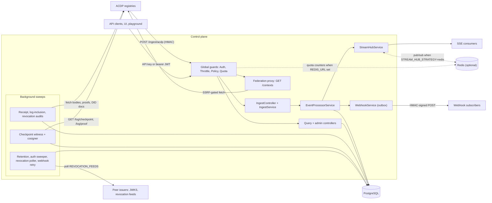
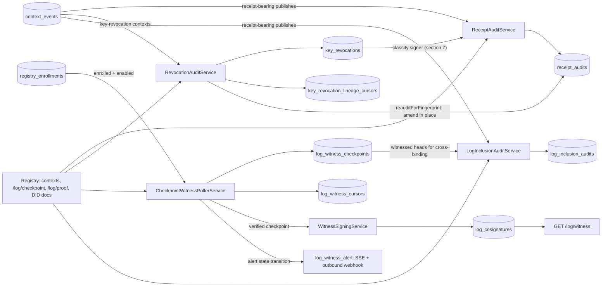

# ACDP Control Plane — Architecture

## System Context

The ACDP Control Plane is a NestJS service that sits **downstream** of the ACDP
registries (which authoritatively store contexts and emit lifecycle webhooks) and
**upstream** of any UI / playground / observer. It:

1. **Ingests** webhook events from registries (HMAC-SHA256 authenticated).
2. **Correlates** events into *runs* via the `X-Run-Id` header.
3. **Persists** raw events, run records, and a lineage adjacency table.
4. **Broadcasts** the firehose via SSE — both per-run and global feeds.
5. **Proxies** federated context retrievals to the authoring registry (SSRF-gated).
6. **Authenticates & authorizes** callers (API keys + JWT issuance + federation),
   isolates them by **tenant**, and gates actions with **policy** and **quota**.
7. **Audits & witnesses** registry honesty: cross-checks embedded registry
   receipts (RFC-ACDP-0010), witnesses transparency-log checkpoints and audits
   inclusion proofs (RFC-ACDP-0012), verifies producer key-revocation contexts
   (RFC-ACDP-0014), and mints/consumes witness cosignatures with N-witnessed
   quorum (RFC-ACDP-0015).

> Where this service mirrors protocol or registry behavior (crypto, SSRF, did:web,
> auth challenge-response, tenancy, webhook event shapes), it relies on the
> [`acdp` SDK](https://github.com/agentcontextdistributionprotocol/acdp-rs/blob/main/docs/bindings.md) and
> tracks the [registry](https://github.com/agentcontextdistributionprotocol/acdp-registry-rs/blob/main/docs/README.md)
> rather than re-implementing. See the ecosystem map in [README.md](./README.md#ecosystem--sources-of-truth)
> and the link index in [README.md — Sibling docs](./README.md#sibling-docs).



Routes, grouped (full index with auth/quota/policy columns in
[API.md](./API.md#route-index)): ingest and run-notify (`/ingest/*`,
`/runs/started`, `/runs/:runId/complete`); read APIs (`/runs`, `/events`,
`/agents`, `/capabilities`, `/registries`, `/dashboard/overview`,
`/domain-packs`, `/routing/stats`); SSE (`/runs/:runId/events/stream`,
`/events/stream`); `/contexts/*ctxId`; `/webhooks`; auth (`/auth/challenge`,
`/auth/token`, `/auth/token/revoke`, `/auth/introspect`, `/auth/revocations`,
`/.well-known/jwks.json`); witness (`/log/witness`,
`/.well-known/acdp-witness.json`, `/.well-known/did.json`); admin
(`/registries/enroll`, `/registries/log-witness/alerts`,
`/registries/:authority/log-witness[/ack]`, `/admin/pinned-keys/reload`);
probes (`/healthz`, `/readyz`, `/metrics`, `/docs`).

## Module layout

```
src/
├── main.ts                    # Entry: .env preload (load-env.ts), then bootstrap()
├── load-env.ts                # Side-effect preload: applyEnvFile(process.env)
├── env-file.ts                # .env parser/merger (util.parseEnv; env wins; missing = no-op)
├── bootstrap.ts               # Boot wiring: pino, helmet, swagger, OTel, migrations, rawBody, shutdown
├── shutdown.ts                # Signal handler: idempotent close, deadline, exit code
├── shutdown-failures.ts       # Destroy-hook failure collector (exit 1 under Nest 12)
├── app.module.ts              # Wiring + the four APP_GUARDs + StreamHub strategy factory
│
├── config/                    # AppConfigService (single home for all process.env reads)
├── db/                        # Drizzle schema, Pool wrapper, programmatic migrate runner
├── middleware/                # Correlation-ID (AsyncLocalStorage), request logger, drain gate
│
├── auth/                      # AuthGuard, throttle guard, JWT issuance, federation, revocation
│   └── did-web/               # did:web resolver + SSRF guard (acdp SDK wrappers)
├── tenant/                    # Tenant resolution + DEFAULT_TENANT_ID + lookups
├── policy/                    # PolicyGuard + static/OPA deciders + caching
├── quota/                     # QuotaGuard + memory/Redis windowed counters
│
├── ingest/                    # POST /ingest/acdp + HMAC verify + body caps + gates
├── processor/                 # EventProcessorService — the pipeline core
│
├── storage/                   # Repositories: context-event, run, lineage, agent, registry,
│                              #   context-lifecycle, registry-enrollment, receipt-audit,
│                              #   log-witness, log-cosignature, log-inclusion-audit, key-revocation
├── audit/                     # Receipt audit (RFC-ACDP-0010), checkpoint witness +
│                              #   log-inclusion audit (RFC-ACDP-0012), Merkle log-verify,
│                              #   cosignature helpers, registry-profile probe,
│                              #   key-revocation audit + lineage walk (RFC-ACDP-0014)
├── witness/                   # Witness cosigning (RFC-ACDP-0015): signing service +
│                              #   /log/witness, /.well-known/acdp-witness.json, did.json
├── webhooks/                  # Outbound webhook subs + outbox-tracked delivery + retry sweep
├── events/                    # StreamHub (memory + redis strategies), /events controller
├── runs/                      # /runs controller + service (run-notify feeds the bandit)
├── contexts/                  # Federation proxy + SafeFederationClient (SSRF)
├── agents/                    # /agents + signed capability declare/discovery
├── routing/                   # BanditRouter (Thompson sampling) + /routing/stats
├── registries/                # /registries + admin enrollment + log-witness views
├── domain-packs/              # Compiled-in context_type packs, boot-selected; GET /domain-packs
├── dashboard/                 # /dashboard/overview KPIs (tenant-scoped)
├── retention/                 # DataRetentionService (periodic purge)
├── health/                    # /healthz, /readyz + ReadinessService (bounded DB probe)
├── metrics/                   # /metrics (Prometheus)
│
├── contracts/                 # Wire types (AcdpWebhookEvent, AcdpStreamEvent, LineageDag)
├── errors/                    # AppException + ErrorCode + GlobalExceptionFilter
├── telemetry/                 # OTel SDK init + InstrumentationService (all prom-client metrics)
└── common/                    # Shared helpers: correlation, pino logger, retry-after,
                               #   trust-proxy, multibase (did:key), did-authority
```

## The pipeline (`EventProcessorService.process`)

`IngestService` authenticates and validates the request first (HMAC,
enrollment, tenant, domain-pack gate — see [INGEST.md](./INGEST.md#request-lifecycle),
which has the sequence diagram). The processor then runs these steps; the
numbers match the comments in `src/processor/event-processor.service.ts`:

| # | Step | Mutation |
|---|------|----------|
| 1 | persist raw + dedup | `INSERT INTO context_events … ON CONFLICT DO NOTHING` on `(tenant_id, fingerprint)`. A conflict means a duplicate: the processor **returns here** with no further side effects ([INGEST.md](./INGEST.md#idempotency)). The full payload is kept as `raw_payload`; `key_fingerprint` and `receipt_present` are lifted into columns. |
| 2 | run correlation | Only when a run id is present. Reads the `(tenant_id, run_id)` row, then inserts it (status `running`) or updates it: `contexts_count + 1`, authority appended to `registries` if new. |
| 3 | lineage edges | `context_published` with `derived_from`: one `INSERT … ON CONFLICT DO NOTHING` into `lineage_edges` per entry. |
| 3b | lifecycle projection | `context_retracted` / `context_republished`: upsert `context_lifecycle` (RFC-ACDP-0013 mark-not-delete; lifts `actor` + `reason`), guarded on the event timestamp so replays and out-of-order deliveries are no-ops. |
| 4 | agent upsert | When `agent_id` is set: `INSERT … ON CONFLICT (tenant_id, agent_did) DO UPDATE` — bumps `last_seen`, `context_count`. |
| 5 | registry upsert | Same shape on `registries` (`event_count`, `last_seen`); stores the base URL (`registry_base_url`, else `Origin`, else the enrollment's). |
| 6 | SSE publish | `AcdpStreamEvent` to the per-run feed (when there is a run id) and the global feed, both partitioned by tenant. Trust and lifecycle signals pass through (`keyFingerprint`, `receiptPresent`, `actor`, `reason`). |
| 7 | outbound webhooks | `void webhookService.fireEvent(…)` — **not awaited**; the outbox rows are written inside `fireEvent` (see [Webhook outbox](#webhook-outbox--retry)). |

Every write is stamped with the resolved `tenant_id`. Steps 1–5 are separate
statements, not one transaction. The lineage DAG is a property of *published*
contexts only. Metrics `acdp_events_ingested_total`, and for publishes
`acdp_publish_receipts_total` / `acdp_producer_did_method_total`, are
incremented after step 1.

## Request guards (the four-guard chain)

Registered in `app.module.ts` as `APP_GUARD`s and evaluated **in registration
order**. Each later guard depends on state pinned by an earlier one.

| # | Guard                  | Always on? | Opt-in                | Responsibility |
|---|------------------------|------------|-----------------------|----------------|
| 1 | `AuthGuard`            | yes        | `@Public()` bypasses  | API-key or bearer-JWT auth; pins `req.tenantId`, `req.actorDid`, `req.actorScopes`, `req.actorIsAdmin` (API keys only; a JWT is never admin), `req.actorIssuer`, `req.actorFederated` |
| 2 | `ThrottleByUserGuard`  | yes        | `@SkipThrottle()` (probes only) | Coarse per-principal request rate limit (`THROTTLE_LIMIT`/`THROTTLE_TTL_MS`); unauthenticated → client IP, IPv6 per `/64` (`THROTTLE_IPV6_SUBNET_PREFIX`) |
| 3 | `PolicyGuard`          | no-op      | `@CheckPolicy(action)`| Per-action authorization via a pluggable `PolicyDecider` |
| 4 | `QuotaGuard`           | no-op      | `@CheckQuota(action)` | Per-tenant per-action windowed counters; runs **last** so requests denied by auth/policy don't burn an increment |

`/ingest/acdp` is `@Public()` because HMAC is its authentication; its quota is
counted before the HMAC check, against `default`
([INGEST.md](./INGEST.md#quota-and-rate-limits)). See [POLICY.md](./POLICY.md)
for policy/quota detail and [AUTH.md](./AUTH.md) for the auth model.

**Client IP.** `req.ip` is the TCP peer unless `TRUST_PROXY` names the proxies
in front (`applyTrustProxy`, `src/common/trust-proxy.ts`, called from
`bootstrap()`); nothing in `src/` parses `X-Forwarded-For` itself. See
[CONFIGURATION.md](./CONFIGURATION.md).

**Error labelling.** `GlobalExceptionFilter` (`src/errors/exception.filter.ts`)
gives every error the JSON envelope with an `errorCode`. An unlabelled 4xx gets
a status-keyed generic code (`INVALID_PAYLOAD`, `UNAUTHORIZED`, `FORBIDDEN`,
`NOT_FOUND`, `PAYLOAD_TOO_LARGE`, `RATE_LIMITED`, `REQUEST_REJECTED`);
`INTERNAL_ERROR` is 5xx only. Code table: [API.md](./API.md#error-responses).

## Tenancy

The **tenant** is the unit of data isolation. `AuthGuard` resolves it (from a
tenant-bound API key, the JWT `tenant` claim, or — only in non-strict mode — the
absence of any assertion → `default`) and pins `req.tenantId`. Controllers read
it with `tenantOf(req)` and thread it into every repository call; repositories
filter `WHERE tenant_id = …` and stamp it on writes, with composite conflict
targets that include `tenantId`. A spoofed `X-Tenant-Id` that disagrees with the
signed/bound tenant is rejected. HMAC routes resolve the tenant differently
([INGEST.md](./INGEST.md#tenant-attribution)). See [TENANCY.md](./TENANCY.md).

## SSE strategies

`StreamHubService` consumes a strategy injected via the `STREAM_HUB_STRATEGY`
token in `AppModule` — services never depend on a concrete strategy. Both
strategies **partition by tenant**: the global feed is one subject per tenant,
and per-run subjects are keyed `tenantId:runId`, so a subscriber sees only its
own tenant's events and two tenants cannot share a run feed.

| Strategy | When to use | Behavior |
|----------|-------------|----------|
| `memory` (default) | single instance | Per-run RxJS `Subject` map + one global `Subject` per tenant; per-run subjects GC'd ~60 s after the last subscriber disconnects |
| `redis`            | multi-instance HA | One Redis pub/sub channel (`acdp:stream-hub`, needs `REDIS_URL`) carrying the tenant with each message; each instance re-emits inbound messages on its local Subjects |

Heartbeat frames (`event: heartbeat`) are emitted every `STREAM_SSE_HEARTBEAT_MS`
(default 15 s) to keep intermediaries from closing idle connections.

## Webhook outbox + retry

Outbound webhooks are **outbox-tracked**. The processor's step 7 calls
`WebhookService.fireEvent` without awaiting it. `fireEvent` lists the tenant's
active subscriptions whose `events` filter matches (empty = all), and for each
one inserts a `webhook_deliveries` row (`status='pending'`) **before** starting
that delivery. Each delivery is a `POST` signed with HMAC-SHA256 using the
subscription's `secret` (header `X-ACDP-Signature: sha256=…`, event type in
`X-ACDP-Event`).

A delivery makes up to **3 attempts** inline with backoff, then the row is
`failed` (terminal, kept for inspection). On a subscriber `429` the attempt
honours `Retry-After` (delta-seconds or HTTP-date, `src/common/retry-after.ts`)
by persisting `next_attempt_at` and leaving the row `pending`. A background
**retry sweep** (`WEBHOOK_RETRY_INTERVAL_MS`, default 5 min; `≤0` disables)
re-attempts `pending` rows that are due, across all tenants. Subscriber URLs
pass the SSRF policy at registration **and** at delivery: HTTPS only, no IP
literals, resolved IPs not private/loopback, redirects refused
(`WEBHOOK_SSRF_ALLOW_HTTP` / `WEBHOOK_SSRF_ALLOW_LOOPBACK` relax it for local
testing).

## Auth, federation & revocation (summary)

- **API keys** (`AUTH_API_KEYS`, tenant-mapped `TENANT_API_KEYS`) and **bearer
  JWTs** issued via `/auth/challenge` + `/auth/token` (Ed25519/ECDSA-P256
  challenge-response, only when `TOKEN_ISSUANCE_ENABLED=true`). The guard
  accepts either.
- JWTs from **trusted external issuers** (`TRUSTED_ISSUERS`, each with a required
  `audience`) are accepted via `CrossIssuerValidatorService` (remote JWKS). An entry may
  carry the opt-in `read_only` flag: `AuthGuard` then limits its tokens to
  GET/HEAD/OPTIONS (`ISSUER_READ_ONLY`), and `iss`/`federated` reach `PolicyRequest`.
- **Revocation is bidirectional**: the CP serves `/auth/revocations` and consumes
  peer feeds (`REVOCATION_FEEDS`) with issuer confinement + durable per-issuer
  cursors, so a single `isRevoked(iss, jti)` check honors local *and* propagated
  revocations.

Full detail in [AUTH.md](./AUTH.md).

## Capabilities, routing & domain packs

- **Signed capability declarations**: agents sign
  `acdp-cap:v1:<agent_did>:<capability_uri>:<declared_at>` with their pinned key;
  `CapabilityService` validates URN/skew/algorithm/signature and persists
  idempotently. Discovery via `/capabilities/search` and `/capabilities/by-agent/*did`.
- **`BanditRouter`** (`src/routing/bandit-router.service.ts`) keeps a
  Thompson-sampling Beta posterior per `(scenario, agent)`, in process memory.
  Its only input today is run completion: `POST /runs/:runId/complete` with
  `completed` (reward 1) or `failed` (reward 0) rewards every agent that
  published in the run. No endpoint calls its `route()` selection yet; the arms
  are readable at admin-only `GET /routing/stats`. `BANDIT_EXPLORATION_FRACTION`
  (default 0.05) sets the uniform-random exploration share.
- **Domain packs** are compiled in (`src/domain-packs/known-packs.ts`), selected
  at boot by `DOMAIN_PACKS` (an unknown name fails startup), and listed by
  `GET /domain-packs`; there is no runtime reload. When ≥1 pack is active they
  gate ingest `context_type` — see
  [INGEST.md](./INGEST.md#domain-pack-context_type-gate).

## Transparency, audit & witness (RFC-ACDP-0010 / 0012 / 0014 / 0015)

> **Sources of truth.** The receipt, checkpoint, Merkle-proof, revocation, and
> cosignature wire formats and verification procedures are normative in the
> spec —
> [RFC-ACDP-0010](https://github.com/agentcontextdistributionprotocol/agentcontextdistributionprotocol/blob/34f14ab2ab454308e94fd6f137ef940db45c72c8/rfcs/RFC-ACDP-0010-registry-receipts.md)
> (receipts),
> [RFC-ACDP-0012](https://github.com/agentcontextdistributionprotocol/agentcontextdistributionprotocol/blob/34f14ab2ab454308e94fd6f137ef940db45c72c8/rfcs/RFC-ACDP-0012-transparency-log.md)
> (transparency log),
> [RFC-ACDP-0014](https://github.com/agentcontextdistributionprotocol/agentcontextdistributionprotocol/blob/34f14ab2ab454308e94fd6f137ef940db45c72c8/rfcs/RFC-ACDP-0014-key-revocation.md)
> (producer key-revocation),
> [RFC-ACDP-0015](https://github.com/agentcontextdistributionprotocol/agentcontextdistributionprotocol/blob/34f14ab2ab454308e94fd6f137ef940db45c72c8/rfcs/RFC-ACDP-0015-witness-cosigning.md)
> (cosigning) — and the registry side is documented in
> [acdp-registry-rs/docs/RECEIPTS.md](https://github.com/agentcontextdistributionprotocol/acdp-registry-rs/blob/main/docs/RECEIPTS.md).
> This section is **not** a restatement of those — it describes only what *this
> service* does as an observer: which sweeps run, what each records, and where
> the verdicts surface. Verification itself (JCS, signatures, Merkle folds,
> DID/key lifecycle, §7 classification, quorum) comes from the `acdp` SDK
> ([bindings](https://github.com/agentcontextdistributionprotocol/acdp-rs/blob/main/docs/bindings.md)).

Four independent, advisory-locked sweeps make the control plane a second
observer of registry honesty — each gated by its own env flag and each
recording verdicts in its own table so the signals stay independent. All
fetches go through the SSRF-gated `SafeFederationClient`, and all four share
`RegistryProfileService`'s cached probe of the registry's
`/.well-known/acdp.json` profiles.



| Sweep (flag) | What the CP does | Evidence table | Surfaces |
|-------|----------|----------------|----------|
| `ReceiptAuditService` (`RECEIPT_AUDIT_ENABLED`) | Checks each stored publish's `registry_receipt`: profile coverage, field equality with the event, `created_at` skew, full signature. With `KEY_REVOCATION_CHECK_ENABLED`, also classifies the signer against verified revocations (below). | `receipt_audits` | `trust` member on `GET /runs/:runId`; `acdp_receipt_audits_total{status}`; `acdp_receipt_audit_key_revocation_total{status}`; `acdp_receipt_audit_revocation_reaudits_total{status}`; dashboard `receiptCoverage`, `keyRevocation` |
| `CheckpointWitnessPollerService` (`LOG_WITNESS_ENABLED`) | For enrolled, enabled registries advertising the transparency-log profile (minus `LOG_WITNESS_EXCLUDE_AUTHORITIES`): fetches `GET /log/checkpoint`, verifies it, and checks consistency against the head it retains. | `log_witness_checkpoints` + `log_witness_cursors` | `GET /registries/:authority/log-witness`, `GET /registries/log-witness/alerts`; `log_witness_alert` SSE/webhook on state transition; `acdp_log_witness_alerts_total{reason}` |
| `LogInclusionAuditService` (`LOG_INCLUSION_AUDIT_ENABLED`) | Rebuilds the leaf from the CP's stored receipt, fetches `/log/proof?ctx_id=`, verifies inclusion, and cross-binds against witnessed heads. | `log_inclusion_audits` | verdicts `included` \| `invalid_proof` \| `not_logged` \| `no_log` \| `error` |
| `RevocationAuditService` (`KEY_REVOCATION_CHECK_ENABLED`) | Finds `key-revocation` contexts by `context_type`, fetches and verifies each body (`AcdpVerifier.parseKeyRevocation`), walks the revocation's lineage, and every pass triggers the receipt re-audit for each fingerprint it holds a fact for. | `key_revocations` (permanent, retention-exempt) + `key_revocation_lineage_cursors` | `acdp_key_revocation_checks_total{status, trust_class}`; `acdp_key_revocation_lineage_members_total{status}` |

Witness transport and DID failures are environmental
(`log_witness_cursors.consecutive_failures`), never dishonesty alerts; the
retained head advances only on full success. `ErrorCode.INVALID_LOG_PROOF` is
the category for a locally failing checkpoint or proof.

### Key revocation (RFC-ACDP-0014)

The fold, boundary and disarm rules are the RFC's
([§4](https://github.com/agentcontextdistributionprotocol/agentcontextdistributionprotocol/blob/34f14ab2ab454308e94fd6f137ef940db45c72c8/rfcs/RFC-ACDP-0014-key-revocation.md),
§6, §7) and are evaluated by the SDK. What the CP decides:

- **Lineage walk failure discipline** (`src/audit/revocation-lineage.ts`,
  `classifyLineageFailure`): a member that fails verification permanently is
  dropped with a warning and the rest still fold; a transient failure aborts
  the whole walk with no partial result; a lineage too large to fetch, or more
  than `MAX_LINEAGE_WALKS` (100) lineages in one pass, aborts the same way.
- **Cursors are freshness markers only.** A `key_revocation_lineage_cursors`
  row is written only after a fully successful walk, expires after
  `KEY_REVOCATION_LINEAGE_CURSOR_TTL_HOURS`, and never skips a walk for a
  lineage that has zero recorded facts.
- **Recording versus acting.** Every verified fact is recorded, with its
  `publisher` and `trust_class`. `KEY_REVOCATION_ATTESTED_SCOPE` and
  `KEY_REVOCATION_IGNORE_FINGERPRINTS` apply only when a receipt audit
  classifies a signer, never at recording time.
- **Classification result.** `classifyKeyRevocation`
  (`src/audit/receipt-audit.service.ts`) wraps
  `AcdpVerifier.classifyUnderRevocation` and stores the verdict in four
  `receipt_audits` columns (`key_revocation_status`, `_trust_class`,
  `compromise_boundary`, `_sources`), surfaced as `trust.revoked`. The receipt time counts as verified only when
  the receipt verdict is `verified` or `verified_historical`; otherwise a
  revoked key classifies fail-closed. Postgres timestamps are normalized to
  strict RFC 3339 before the SDK call.
- **Retroactive re-audit.** `reauditForFingerprint` amends already-sealed
  `receipt_audits` rows in place. It is monotone (a row's boundary only moves
  earlier), column-scoped (only the four columns above), and auditable
  (`key_revocation_sources` names the revocations), all enforced in the SQL of
  `ReceiptAuditRepository.amendKeyRevocation`. Each pass handles up to
  `RECEIPT_AUDIT_BATCH_SIZE` rows per fingerprint.
- **Accepted limitations** (see [ASSUMPTIONS.md](../ASSUMPTIONS.md), Phase 15
  entries): candidates are found by the registry-claimed
  `context_events.key_fingerprint`, so pre-0.2.0 events without one are never
  re-audited; and retention purges `context_events` but not `receipt_audits`,
  so a purged event's audit row is orphaned and frozen at its last verdict.

`KEY_REVOCATION_CHECK_ENABLED` requires `RECEIPT_AUDIT_ENABLED=true`
(startup check outside `NODE_ENV=development`). The two revocation metrics stay
separate on purpose: `acdp_key_revocation_checks_total` counts webhook
candidates, `acdp_key_revocation_lineage_members_total` counts lineage members
a walk evaluated, re-counted on every retry, so read it as a rate.

### Witness cosigning and quorum (RFC-ACDP-0015)

Normative rules: [RFC-ACDP-0015](https://github.com/agentcontextdistributionprotocol/agentcontextdistributionprotocol/blob/34f14ab2ab454308e94fd6f137ef940db45c72c8/rfcs/RFC-ACDP-0015-witness-cosigning.md)
and the [cosignature schema](https://github.com/agentcontextdistributionprotocol/agentcontextdistributionprotocol/blob/34f14ab2ab454308e94fd6f137ef940db45c72c8/schemas/json/acdp-log-cosignature.schema.json).
Minting and consuming are independent switches.

- **Minting** (`WITNESS_COSIGNING_ENABLED`, rides `LOG_WITNESS_ENABLED`):
  `WitnessSigningService` signs every verified checkpoint observation with a
  dedicated Ed25519 key (`WITNESS_ID`, `WITNESS_SIGNING_PRIVATE_KEY_PEM`,
  optional `WITNESS_KEY_ID`; never the JWT key) into `log_cosignatures`, one
  row per observation. Served, `@Public()`, at `GET /log/witness`,
  `/.well-known/acdp-witness.json` and `/.well-known/did.json`; all three 404
  when minting is off. The CP never aggregates cosignatures into a
  `/log/checkpoint` of its own.
- **Cosignature retention**: `DataRetentionService` keeps, per
  `(witness, log, tree_size, root_hash)`, the newest
  `WITNESS_COSIGNATURE_KEEP_PER_HEAD − 1` rows plus the oldest, and purges the
  rest older than the TTL (`LogCosignatureRepository.purgeOldPerTuple`).
- **Quorum consumption** (`WITNESS_QUORUM_ENABLED`, rides `LOG_WITNESS_ENABLED`):
  counts distinct `WITNESS_QUORUM_TRUSTED` witnesses on each fetched checkpoint
  and records `witnessed_count` / `meets_quorum` against
  `WITNESS_QUORUM_MIN_WITNESSES` in `log_witness_checkpoints`.
- **Freshness split**: cosignatures older than `WITNESS_QUORUM_MAX_AGE_SECONDS`
  still count toward `witnessed_count` but not toward
  `fresh_witnessed_count` / `meets_fresh_quorum`. One dated beyond
  `WITNESS_QUORUM_MAX_CLOCK_SKEW_SECONDS` in the future does not count at all.
- **Witness key resolution**: a `did:key` witness is decoded locally
  (`src/common/multibase.ts`, no fetch); a `did:web` witness resolves via
  `DidWebResolverService.resolveWitnessKey`. A signature by a retired key
  counts only in `historical_witnessed_count`, never in `witnessed_count`.
- **Failing cosignatures** are reported as `INVALID_WITNESS_COSIGNATURE`
  (distinct from `INVALID_LOG_PROOF`): the cosignature does not count, and the
  checkpoint is not failed.

Boot checks: a `did:web` `WITNESS_ID` whose host differs from `PUBLIC_HOST`
fails startup (unset `PUBLIC_HOST` only warns); minting or quorum without
`LOG_WITNESS_ENABLED`, and quorum with `WITNESS_QUORUM_MIN_WITNESSES < 1`, fail
startup outside `NODE_ENV=development`. `bootstrap()` also refuses to start if
the SDK's Ed25519 verification is not strict (`assertStrictEd25519`).

## Data model

21 Drizzle tables in `src/db/schema.ts`, created by the SQL migrations in
`drizzle/` (applied in filename order at boot; applied names are recorded in
`_migrations`, which the runner creates and `schema.ts` does not declare).
Every table except `auth_challenges`, `revoked_tokens`, `revocation_cursors`
and `issuance_ledger` carries a `tenant_id`.

| Table | Holds | Created | Later changed |
|-------|-------|---------|---------------|
| `context_events` | Every ingested event, raw payload + lifted columns, dedup fingerprint | 0000 | 0001, 0006, 0009, 0011, 0014, 0022, 0024 |
| `runs` | One row per `(tenant, run_id)` | 0000 | 0001, 0006, 0008 |
| `lineage_edges` | `derived_from` edges | 0000 | 0001, 0007, 0008 |
| `agents` | Producers seen on ingest | 0000 | 0006, 0008 |
| `webhooks` | Outbound subscriptions | 0000 | 0007 |
| `webhook_deliveries` | Outbox rows | 0000 | 0001, 0007, 0012 |
| `registries` | Authorities seen on ingest + base URL | 0002 | 0007, 0008 |
| `auth_challenges` | Pending `/auth/challenge` nonces (`AUTH_PERSISTENCE=postgres`) | 0003 | — |
| `revoked_tokens` | Local + imported JWT revocations, keyed `(iss, jti)` | 0003 | 0025 |
| `issuance_ledger` | Hash-chained token-issuance audit log | 0004 | — |
| `agent_capabilities` | Signed capability declarations | 0005 | 0007, 0008 |
| `registry_enrollments` | Authority → tenant, secret, base URL, enabled | 0010 | — |
| `revocation_cursors` | Per-issuer cursor for peer revocation feeds | 0013 | — |
| `receipt_audits` | Receipt-audit verdicts + §7 revocation columns | 0014 | 0023, 0024 |
| `context_lifecycle` | Retract/republish projection | 0015 | — |
| `log_witness_checkpoints` | Witnessed checkpoints + quorum counts | 0016 | 0018, 0019, 0020, 0021 |
| `log_witness_cursors` | Retained head + alert state per `(tenant, registry)` | 0016 | 0018 |
| `log_inclusion_audits` | Inclusion-proof verdicts | 0016 | — |
| `log_cosignatures` | Cosignatures this CP minted | 0017 | 0019, 0020 |
| `key_revocations` | Verified key-revocation facts | 0022 | — |
| `key_revocation_lineage_cursors` | Lineage-walk freshness markers | 0022 | — |

Migrations: `0000_init`, `0001_indexes`, `0002_registries`,
`0003_auth_persistence`, `0004_issuance_ledger`, `0005_agent_capabilities`,
`0006_tenant_id`, `0007_tenancy_completion`, `0008_composite_tenant_keys`,
`0009_event_fingerprint`, `0010_registry_enrollments`, `0011_widen_fingerprint`,
`0012_webhook_next_attempt`, `0013_revocation_cursors`, `0014_trust_metadata`,
`0015_context_lifecycle`, `0016_log_witness`, `0017_log_cosignatures`,
`0018_witness_quorum`, `0019_witness_tenant_scope`,
`0020_cosignature_freshness`, `0021_witness_historical_quorum`,
`0022_key_revocations`, `0023_receipt_audit_revocation`,
`0024_revocation_reaudit` (indexes only), `0025_revocation_iss_jti_key`.

## Retention

`DataRetentionService` (off unless `DATA_RETENTION_ENABLED`; every
`DATA_RETENTION_INTERVAL_HOURS`, default 24, advisory-locked) deletes, across
all tenants, rows older than `DATA_RETENTION_TTL_DAYS` (default 30):

| Table | Deleted when |
|-------|--------------|
| `context_events` | `event_ts` is older than the cutoff |
| `runs` | status is `completed`/`failed`/`cancelled` and `completed_at` is older than the cutoff |
| `webhook_deliveries` | status is `delivered` and `created_at` is older than the cutoff (`failed` and `pending` rows stay) |
| `log_cosignatures` | older than the cutoff and outside the per-tuple keep set (see [cosigning](#witness-cosigning-and-quorum-rfc-acdp-0015)) |

`AuthSweeperService` (every `AUTH_SWEEP_INTERVAL_SECONDS`, default 300)
deletes expired `auth_challenges` and `revoked_tokens` rows. Nothing deletes
from the other tables: `key_revocations` is exempt by design (a revocation is
never undone), and `receipt_audits`, `log_inclusion_audits`, the
`log_witness_*` tables, `lineage_edges`, `agents`, `registries`,
`context_lifecycle` and `issuance_ledger` grow without bound. A purged event
also stops deduping, so a replay of it is ingested again.

## Operational concerns

- **Migrations** run programmatically at boot (`src/db/migrate.ts`) from SQL
  files committed under `drizzle/` (no `drizzle-kit` at runtime). Applied
  migrations are tracked in `_migrations`. Table-to-migration map: [Data model](#data-model).
- **Readiness** (issue #210): `GET /readyz` is drain-first (`DrainState`, #192),
  then asks `ReadinessService` (`src/health/readiness.service.ts`) — the single
  authority for dependency health, itself drain-agnostic. Its database check is
  `SELECT 1` on the **shared** app pool (so it measures what a request would get,
  checkout included), bounded by pg's `query_timeout` and an outer deadline of
  `READINESS_DB_TIMEOUT_MS`, **single-flight** (one probe query at a time, held
  until the query really settles, so probes never pin more than one pool client)
  and **cached** for `READINESS_CACHE_MS`. Not ready → `503
  DEPENDENCY_UNAVAILABLE` with an enum reason (`error`/`timeout`), never driver
  text. Because cost is bounded by the cache rather than the request rate, the
  whole `HealthController` is `@SkipThrottle()`; successful probe request-log
  lines are `debug`. State changes log once (`readiness changed`) and move
  `acdp_dependency_up` / `acdp_readiness_checks_total`. Single-flight relies on
  the pool's own bounds releasing a stuck probe, hence
  `DB_POOL_CONNECTION_TIMEOUT > 0` at boot.
- **Liveness** (issue #210 Phase 2): `GET /healthz` answers "is this process
  wedged?" and **never awaits I/O** — the CP equivalent of the registry's
  `/livez`. A database outage is not fixed by a restart, so its status is 200
  whenever the process can answer (only the #192 drain gate 503s it, in
  `closing`). Its in-band `ok` mirrors `ReadinessService.snapshot()`, the last
  readiness verdict; a missing or stale (older than `max(READINESS_CACHE_MS,
  5000)` ms) snapshot starts a fire-and-forget `evaluate()` — the same
  single-flight probe — except while draining. There is no pool-error latch: a
  pool `'error'` (an idle client lost its socket; pg-pool reconnects on demand)
  is logged by `DatabaseService` and counted on `acdp_db_pool_errors_total` by
  a second listener `ReadinessService` attaches (it, not the global
  `DatabaseModule`, can see `InstrumentationService`).
- **Report-only dependencies and pool gauges** (issue #210 Phase 3):
  `ReadinessService` adds `checks.streamHub` / `checks.quotaStore`
  (`{ status, required: false }`) when Redis backs the stream hub or the quota
  store, read synchronously from the ioredis connection state. They **never**
  affect `ready`: Redis loss degrades cross-replica SSE fan-out (quota fails
  open) and hits every replica alike, so gating would turn a partial
  degradation into a total outage. The same sources feed
  `acdp_dependency_up{dependency="redis_stream_hub"|"redis_quota_store"}`, and
  `acdp_db_pool_connections{state="total"|"idle"|"waiting"}` reads the pool at
  scrape time, so operators can tell "DB down" from "pool saturated".
- **Graceful shutdown** via `src/shutdown.ts`: a single idempotent handler on
  SIGINT/SIGTERM first **begins the drain** (issue #192), optionally waits
  `SHUTDOWN_DRAIN_DELAY_MS`, and then calls `app.close()`. `DrainState` moves
  through three monotone phases, `serving → draining → closing`. Drain sequence:
  1. `DrainState.begin()` (`src/shutdown-drain.ts`, a global provider with no
     lifecycle hooks, resolved once in `bootstrap.ts`) enters `draining` — the
     single "are we shutting down?" source — and fires its replaying
     `drained$`. From this moment `GET /readyz` answers `503 SERVICE_DRAINING`
     **without querying the database**: the health controller checks the drain
     first (readiness = `!draining && deps ok`, one code path), so a load
     balancer stops routing here. Every open SSE
     stream (both routes share `src/events/sse-drain.ts`) writes a terminal
     `event: shutdown` with a `retry:` hint and completes. A stream opened
     *after* this point gets the same event at once and never subscribes to the
     stream hub, and `/runs/:runId/events/stream` skips its DB lookup. This runs
     before any destroy hook, so it does not depend on module destroy order or
     on the stream-hub strategy. `StreamHubService`'s teardown stays as the
     backstop.

     **Optional drain delay (Phase 3).** With `SHUTDOWN_DRAIN_DELAY_MS` > 0 the
     handler now waits that long in `draining` before going on. During the
     delay **every other route keeps serving** (the pool is still alive) — the
     point is that a lagging load balancer's requests still succeed while it
     notices the failing readiness probe and deregisters the instance. The
     wait is `unref()`'d and cancellable: a second signal skips the rest of it
     (log `second signal — skipping drain delay`) and never re-enters
     `close()`. The deadline covers only `close()`, so the worst case is delay
     + timeout. Default 0: no timer, and the next step follows in the same
     tick — the Phase 1–2 timing exactly.

     Then `DrainState.beginClosing()` enters `closing`. From that moment, every
     **new** non-SSE request is answered
     `503 SERVICE_DRAINING` (`Retry-After`, `Connection: close`, the JSON
     envelope, CORS and helmet headers, an `X-Request-Id` and a request-log
     line). "New" is decided **at arrival**: a plain Express middleware
     registered in `bootstrap.ts` *before* the body parsers stamps
     `DrainState.phase()` onto the request as soon as its headers are
     parsed (`createDrainArrivalMarker`), and the drain gate
     (`src/middleware/drain-gate.middleware.ts`, module middleware after the
     correlation-id and request-logger middleware, so before every guard)
     decides from that stamp alone — `closing` is rejected, `serving` and
     `draining` pass (the gate has no readiness rule; in `closing` its generic
     503 covers `/readyz` too). Module middleware only runs after the body
     parsers, so a gate reading the live flag would 503 a request whose headers
     arrived before the signal and whose body finished after it. `GET` on the
     two SSE routes is exempt and takes the subscribe-after-drain path above,
     because a non-2xx would stop an `EventSource` from ever reconnecting. A
     CORS preflight is ended by `cors()` (204) before it reaches the gate.
  2. `app.close()` runs the destroy hooks, then Nest's `dispose()` calls
     `httpServer.close()`. That stops the listener and closes the sockets that
     are idle at that moment, once. A 100 ms idle-socket reaper started when the
     close begins calls `server.closeIdleConnections()` on every tick, but **only once
     `server.listening` is false**: `closeIdleConnections()` also destroys a
     just-accepted socket that has not sent its request line yet. Sockets that go
     idle during the close (every SSE stream after its `shutdown` event, every
     request that finishes) are reaped within ~100 ms. Without the reaper they
     would linger for `keepAliveTimeout` + buffer (~6 s), which made shutdowns
     with SSE clients take ~6 s and, with `SHUTDOWN_TIMEOUT_MS` below that,
     exit 1 spuriously. Measured: SIGTERM → exit 0 in ~110 ms with two open
     streams, down from ~6000 ms. In-flight requests are never touched by the
     reaper and keep their full grace.

  Nest's `forceCloseConnections` and `return503OnClosing` adapter options stay
  off: the first drops in-flight requests and still exits 0, and the second's
  bare `text/html` 503 bypasses the error envelope, CORS and `Retry-After`, and
  503s SSE reconnects too (see `plans/archive/graceful-drain-192.md`).

  Each shutdown ends with one structured `shutdown drain complete` line
  (`drainMs`, `drainDelayMs`, `sseStreamsTerminated`, `drainRejections`,
  `forcedConnections`).
  On an overrun the handler first reads a synchronous open-socket count
  (`trackOpenConnections`, never the callback-async `getConnections()`) and logs
  it as `forcedConnections` before `closeAllConnections()`.

  `app.close()` runs every `OnModuleDestroy`, so
  `DatabaseService` drains its pool, `StreamHubService` completes all Subjects and
  background timers are cleared — then flushes OpenTelemetry, then exits 0. The
  close is bounded by `SHUTDOWN_TIMEOUT_MS` (default 10s, an integer ≥ 1000 or boot fails; keep it below the
  platform's termination grace period): `http.Server.close()` waits for active
  connections, so one in-flight request would otherwise hold shutdown open until
  the orchestrator SIGKILLed the process. On overrun the handler drops lingering
  sockets and exits **1**, because a shutdown that dropped live requests is not a
  clean one. A failed destroy hook also exits **1**. NestJS 12 runs destroy
  hooks under `Promise.allSettled` and only *logs* a rejection, so `app.close()`
  resolves even when `pool.end()` throws. To catch this, every hook that releases
  an external resource (`DatabaseService`, `IssuanceLedgerService`, `QuotaModule`,
  `StreamHubService`) runs its teardown through `ShutdownFailures.track()`
  (`src/shutdown-failures.ts`). The handler reads the collector after the close
  (issue #155). A new resource-owning hook must do the same. The boot wiring lives
  in `src/bootstrap.ts`. `main.ts` only preloads `.env` and calls it, so
  `test/fixtures/faulty-teardown.main.ts` can drive a real failing teardown.
  `enableShutdownHooks()` is deliberately **not** called: it would register Nest's
  own signal listeners *in addition* to ours, running the destroy hooks twice
  (`pool.end()` throws "Called end on pool more than once", the process exits 1 and
  telemetry is never flushed — issue #158). `app.close()` already runs the destroy
  and shutdown hooks by itself, and nothing in `src/` implements
  `OnApplicationShutdown`.
- **Background services**: `WebhookService` retry sweep, `AuthSweeperService`
  (deletes expired challenges and revoked-token rows; the issuance ledger is
  never purged), `RevocationPollerService` (consumes peer feeds),
  `DataRetentionService` (off unless `DATA_RETENTION_ENABLED`; scope in
  [Retention](#retention)), plus the four advisory-locked audit sweeps in
  [Transparency, audit & witness](#transparency-audit--witness-rfc-acdp-0010--0012--0014--0015).
  Boot-time witness checks are listed under
  [Witness cosigning and quorum](#witness-cosigning-and-quorum-rfc-acdp-0015).
- **Observability**: pino structured logs, Prometheus metrics
  on `/metrics` (all constructed in `InstrumentationService`), optional OTel SDK
  (`OTEL_ENABLED=true`). Metric inventory in [API.md](./API.md#observability).
- **Logging shape**: `CorrelationIdMiddleware` assigns (or honours an inbound)
  `x-request-id`, echoes it on the response, and holds it in an
  `AsyncLocalStorage` (`src/common/correlation.ts`). `PinoLogger` merges that
  id into **every** line as `requestId`, so a failure logged inside a service
  ties back to the request that caused it; outside a request — the retention,
  receipt-audit and witness sweeps — the field is omitted rather than
  placeholdered. An **object** passed as the message becomes top-level pino
  fields (`msg` is the human summary), which is how the per-request HTTP
  summary emits `method` / `path` / `statusCode` / `durationMs` / `requestId`
  as indexable fields instead of a JSON string. `LOG_LEVEL` sets the
  threshold; dev mode routes through `pino-pretty` when it resolves.
- **Multi-instance**: requires `AUTH_PERSISTENCE=postgres` (shared challenge /
  revocation / ledger state), `STREAM_HUB_STRATEGY=redis`, and a Redis-backed
  quota store (`REDIS_URL`) — otherwise per-process state diverges. Outside
  `NODE_ENV=development`, startup warns for `STREAM_HUB_STRATEGY=memory` and
  `AUTH_PERSISTENCE=memory`. `BanditRouter` arms are always per-process.
- **Dev sandbox**: when the HMAC secret for an ingest request is empty (no
  enrollment secret and no `WEBHOOK_SECRET`), verification is **skipped**.
  Startup refuses an empty `WEBHOOK_SECRET` unless `NODE_ENV=development` (the
  default when unset) — see [INGEST.md](./INGEST.md#authentication--hmac-sha256).

### Deploying behind a load balancer

The listener closes within milliseconds of SIGTERM unless something holds it, so
a load balancer that has not yet noticed the stopping instance routes requests to
a closed port (refused/reset). `SHUTDOWN_DRAIN_DELAY_MS` (issue #192, Phase 3,
default `0`) is the opt-in fix: for that long after the signal `/readyz` returns
`503 SERVICE_DRAINING` while every other route keeps serving, and only then does
the close begin. Set it **or** a Kubernetes `preStop: exec: sleep N` hook, not
both — `preStop` delays the SIGTERM itself but does not flip `/readyz`, and
stacking the two simply adds them. Two inequalities must hold:

- **Termination grace covers the whole drain.**
  `terminationGracePeriodSeconds ≥ (SHUTDOWN_DRAIN_DELAY_MS + SHUTDOWN_TIMEOUT_MS)/1000 + 5`.
  Otherwise the platform SIGKILLs (exit 137) before the forced path can run.
  With `5000` + the default `10000` that is ≥ 20 s (Kubernetes' default 30 s is
  enough). Startup warns when delay + timeout exceeds 25000 ms. For Docker
  Compose the equivalent is `stop_grace_period` (default 10 s, equal to the
  default `SHUTDOWN_TIMEOUT_MS`; `docker-compose.yml` sets 15 s).
- **The readiness probe notices the drain inside the delay.**
  `periodSeconds × failureThreshold` (in ms) must be **shorter** than
  `SHUTDOWN_DRAIN_DELAY_MS`, with margin for the endpoint change to propagate
  to the load balancer. Example: `periodSeconds: 1`, `failureThreshold: 2` →
  2000 ms < 5000 ms. Otherwise the listener closes before the probe has failed
  often enough to deregister the pod.

```yaml
# Illustrative pod spec fragment (the repo ships no manifests).
env:
  - { name: SHUTDOWN_DRAIN_DELAY_MS, value: "5000" }
  - { name: SHUTDOWN_TIMEOUT_MS, value: "10000" }
terminationGracePeriodSeconds: 30   # >= (5000 + 10000)/1000 + 5 = 20
readinessProbe:
  httpGet: { path: /readyz, port: 3001 }
  periodSeconds: 1
  timeoutSeconds: 2                 # > READINESS_DB_TIMEOUT_MS (default 1000 ms, #210)
  failureThreshold: 2               # 2 s to notice < 5 s delay
livenessProbe:
  httpGet: { path: /healthz, port: 3001 }   # never touches the DB (#210)
startupProbe:
  httpGet: { path: /healthz, port: 3001 }
```

**Which probe goes where (issue #210).** Point `livenessProbe` and
`startupProbe` at `/healthz` — it never awaits the database, so a DB outage can
never restart-storm the fleet — and `readinessProbe` at `/readyz` with
`timeoutSeconds ≥ 2`. Docker has no readiness concept, so the image's
`HEALTHCHECK` stays on `/healthz` (2xx = healthy); read `/readyz` (or the
`ok` field of `/healthz`) for dependency health.

Registry webhooks benefit too: the registry's default webhook `max_retries = 3`
gives a retry window of only ~750 ms. During the delay `/ingest/acdp` is still
served, so deliveries keep succeeding while the load balancer deregisters this
instance instead of hitting a 503 or a refused port and being dropped after
three quick retries.
