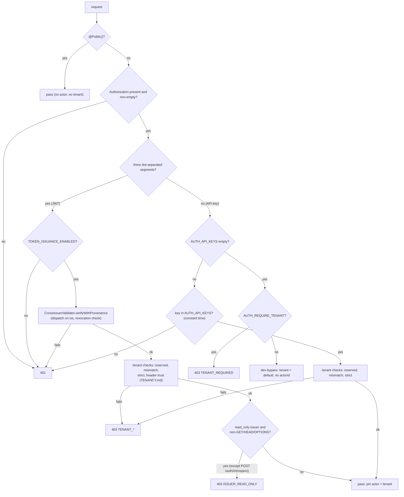
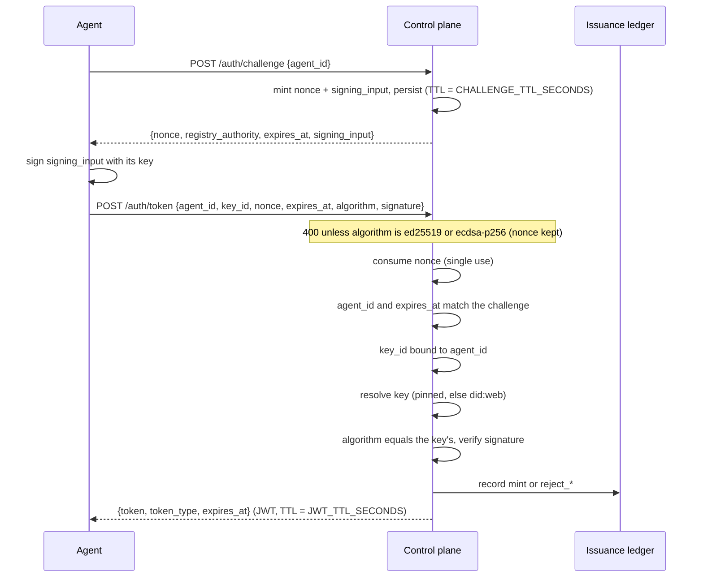

# Authentication, Issuance & Federation

This document covers how the control plane authenticates callers, issues its own
bearer tokens, accepts tokens from federated peers, and propagates revocation.
Endpoint shapes live in [API.md](./API.md#auth); tenancy in [TENANCY.md](./TENANCY.md).

> **This model mirrors the registry.** The CP's challenge-response, JWT claims,
> signing algorithms, and revocation federation are deliberately the same as the
> registry's so agent code and tokens are interchangeable. The authoritative
> description of that shared model is the registry's
> [AUTHENTICATION.md](https://github.com/agentcontextdistributionprotocol/acdp-registry-rs/blob/main/docs/AUTHENTICATION.md).
> The normative wire rules are [RFC-ACDP-0008 §6.2](https://github.com/agentcontextdistributionprotocol/agentcontextdistributionprotocol/blob/34f14ab2ab454308e94fd6f137ef940db45c72c8/rfcs/RFC-ACDP-0008-security.md#62-read-authentication)
> (`bearer_jwt` read authentication; see also the [auth-methods registry](https://github.com/agentcontextdistributionprotocol/agentcontextdistributionprotocol/blob/34f14ab2ab454308e94fd6f137ef940db45c72c8/registries/auth-methods.md))
> and the [signature-algorithms registry](https://github.com/agentcontextdistributionprotocol/agentcontextdistributionprotocol/blob/34f14ab2ab454308e94fd6f137ef940db45c72c8/registries/signature-algorithms.md).
> This page documents only what is **CP-specific** (how those rules are wired,
> issuance ledger, persistence, the guard).

All protocol crypto (Ed25519 / ECDSA-P256 verification, did:web resolution, SSRF
classification) comes from the [`acdp` SDK](https://github.com/agentcontextdistributionprotocol/acdp-rs/blob/main/docs/bindings.md)
(Rust `acdp-rs` via NAPI), wrapped thinly in `src/auth/` — never hand-rolled. The
SSRF defenses the did:web resolver inherits are documented in
[acdp-rs · Security](https://github.com/agentcontextdistributionprotocol/acdp-rs/blob/main/docs/security.md).

## The guard (`AuthGuard`)

`AuthGuard` (`src/auth/auth.guard.ts`) is the first of the four global guards
(registration order in `app.module.ts`: Auth → Throttle → Policy → Quota). For every
non-`@Public()` request it:

1. Reads `Authorization` (an optional `Bearer ` prefix is stripped). A missing header
   or an empty token is a plain `401` — **always**, even in the dev bypass below.
   `@Public()` routes skip the guard entirely
   (`/ingest/acdp`, `/ingest/health`, `POST /runs/started`,
   `POST /runs/:runId/complete` — both HMAC-authenticated like ingest —
   `/auth/challenge`, `/auth/token`, `/.well-known/jwks.json`,
   `/log/witness`, `/.well-known/acdp-witness.json`, `/.well-known/did.json`,
   `/healthz`, `/readyz`, `/metrics`). `/metrics` carries no token gate of its own
   (unlike the registry's separately gated `/metrics`); restrict it at the network edge.
   The CP also has no anonymous mode on guarded routes — unlike the registry, where
   [an unrecognised `Authorization` value means anonymous](https://github.com/agentcontextdistributionprotocol/acdp-registry-rs/blob/main/docs/AUTHENTICATION.md#unrecognised-means-anonymous-on-the-ordinary-routes).
2. **Dispatches on token shape** — a value that splits into exactly three
   `.`-separated segments is treated as a JWT; anything else as an opaque API key
   (so an API key must never contain exactly two dots). There is no cross-fallback (a
   rejected JWT never falls through to API-key matching — an oracle defense).
3. Pins request state used downstream (typed in `src/auth/actor.ts`):

   | Field | JWT | API key |
   |-------|-----|---------|
   | `tenantId` | claim → header (if trusted) → `default` | bound tenant → `default` |
   | `actorId` | `sub` | first 8 chars of the key + `...` |
   | `actorDid` | `sub` | unset |
   | `actorType` | `'jwt'` | `'api-key'` |
   | `actorScopes` | `scope` ∪ `scopes` ∪ `scp` | `[]` |
   | `actorIsAdmin` | always `false` | key ∈ `AUTH_ADMIN_API_KEYS` |
   | `actorIssuer` | verified `iss` | unset |
   | `actorFederated` | `true` iff a `TRUSTED_ISSUERS` entry vouched for it | `false` |

   `actorId` is what `ThrottleByUserGuard` buckets on and what `PolicyGuard` falls back
   to as `subjectDid` when there is no `actorDid` (see [POLICY.md](./POLICY.md#policyrequest)).



### API-key path

- Constant-time membership test against `AUTH_API_KEYS` — the **only** list a key is
  accepted from. `TENANT_API_KEYS` and `AUTH_ADMIN_API_KEYS` only *classify* a key that
  is already in `AUTH_API_KEYS`; a key listed only in either of them is `401`.
- `req.actorIsAdmin` = key ∈ `AUTH_ADMIN_API_KEYS` (constant-time). Admin routes call
  `assertAdmin` (`src/auth/admin.ts`) → `403 ADMIN_REQUIRED` for anyone else.
- Tenant: a key bound in `TENANT_API_KEYS` resolves to its tenant; a bare key →
  `default` and ignores `X-Tenant-Id`. A bound key with a different `X-Tenant-Id` is
  `403 TENANT_MISMATCH`. Full rules: [TENANCY.md](./TENANCY.md#how-the-guard-resolves-the-tenant).
- **Current behaviour — `TENANT_API_KEYS` is parsed lazily**, on the first API-key
  request, not at boot. A malformed entry (`tenant:` with an empty side) or a key bound
  to two tenants throws a plain `Error`, so **every** API-key request then fails with
  `500 INTERNAL_ERROR` instead of the process refusing to start
  (`src/tenant/tenant-context.ts`, `AuthGuard.tenantFor`).
- **Dev bypass.** When `AUTH_API_KEYS` is empty, any non-JWT-shaped
  `Authorization` value is accepted as tenant `default` with no `actorId` (a warning
  is logged per request) — unless `AUTH_REQUIRE_TENANT=true`, which turns it into
  `403 TENANT_REQUIRED`. Boot refuses an empty `AUTH_API_KEYS` whenever
  `NODE_ENV` is anything other than `development` (the default when `NODE_ENV` is
  unset). Because the bypass pins no `actorId`, `PolicyGuard` sees an empty subject:
  under the static policy backend the `@CheckPolicy` routes (`GET /runs…`,
  `GET /contexts/*`, `POST /capabilities`) answer `403 POLICY_DENIED` (`code:
  unauthenticated`) in this mode — set a key even in development to exercise them.

### JWT path

Accepted only when `TOKEN_ISSUANCE_ENABLED=true`: otherwise the validator is not
registered and every JWT-shaped token is `401` (`JWT presented but
TOKEN_ISSUANCE_ENABLED=false`) — including tokens from `TRUSTED_ISSUERS` peers, so
federation also requires issuance to be enabled.

Delegates to `CrossIssuerValidator.verifyWithProvenance(token)`
(`src/auth/cross-issuer-validator.service.ts`), which dispatches on the `iss` claim
(local issuer vs trusted peer — see [Federation](#federation-trusted-external-issuers)),
checks the `(iss, jti)` deny-list, and returns the claims plus which trust entry vouched
for them. Any failure is a generic `401 Invalid authorization token` (the reason is
logged, not returned). On success it pins the fields in the table above —
`actorScopes` is the union of the `scope`, `scopes` and `scp` claims (one vocabulary
shared with the trusted-issuer `requiredScope` gate) — and resolves the tenant from the
signed `tenant` claim. JWTs are never admin (admin is API-key-gated).

Tenant precedence and the reserved-`default` rule are detailed in
[TENANCY.md](./TENANCY.md#how-the-guard-resolves-the-tenant).

### What is mounted only with `TOKEN_ISSUANCE_ENABLED=true`

`AuthModule.forRoot()` (`src/auth/auth.module.ts`) registers nothing but the guard when
issuance is off. With it off, these routes **do not exist** (`404`): `POST /auth/challenge`,
`POST /auth/token`, `POST /auth/token/revoke`, `POST /auth/introspect`,
`GET /auth/revocations`, `GET /.well-known/jwks.json`; and `CrossIssuerValidator`,
`TRUSTED_ISSUERS` parsing, the `RevocationPollerService` (`REVOCATION_FEEDS` only logs a
warning), the issuance ledger and `AUTH_PERSISTENCE` stores are all inactive.
`POST /admin/pinned-keys/reload` is mounted regardless (capability declarations also use
the pinned-key directory).

### Request throttling (`ThrottleByUserGuard`)

The second global guard (`src/auth/throttle-by-user.guard.ts`) is a coarse limit of
`THROTTLE_LIMIT` requests (default 200) per `THROTTLE_TTL_MS` (default 60 000) per
**bucket**, where the bucket is `req.actorId` when `AuthGuard` pinned one, else the client
IP:

- **API key** → `actorId` is the key's first 8 characters + `...`, so keys sharing an
  8-character prefix share one bucket. Give keys distinct prefixes.
- **JWT** → the `sub` DID: every token of one agent shares a bucket.
- **`@Public()` routes and the dev bypass** → `normalizeIp(req.ip)`: IPv4 as-is,
  IPv4-mapped IPv6 folded to IPv4, other IPv6 masked to `/THROTTLE_IPV6_SUBNET_PREFIX`
  (default 64); no IP → one shared `anonymous` bucket. `/auth/challenge` and
  `/auth/token` override the limit to 20 per minute per IP; `/healthz` and `/readyz` skip
  throttling.
- `req.ip` is the TCP peer unless `TRUST_PROXY` names the proxies in front
  (`src/common/trust-proxy.ts`); behind a load balancer without `TRUST_PROXY`, every
  IP-keyed caller shares the balancer's bucket. Nothing in `src/` parses
  `X-Forwarded-For` itself. See [CONFIGURATION.md](./CONFIGURATION.md) (rate limiting,
  `TRUST_PROXY`).
- Because `AuthGuard` runs first, a request it rejects (`401`/`403`) never reaches the
  throttle — failed API-key or JWT attempts are **not** counted (current behaviour).
- Counters live in the throttler's default in-process storage, so the limit is per
  replica.

The per-tenant business quota is separate — see [POLICY.md](./POLICY.md#quota).

## Token issuance (challenge → token)

Enabled by `TOKEN_ISSUANCE_ENABLED=true`. A mirror of the registry's
challenge-response so agent code is reusable.



Order matters for retries: the algorithm check and the DTO bounds run **before** the
nonce is consumed; every later check runs **after**, so a rejected request burns its
challenge and the agent must request a new one.

- **Signing input** (canonical, ASCII):
  `acdp-registry-auth:v1:<nonce>:<agent_did>:<authority>:<expires_at>`. This
  namespaced format is the registry's — see
  [AUTHENTICATION.md → "The signing input is namespaced"](https://github.com/agentcontextdistributionprotocol/acdp-registry-rs/blob/main/docs/AUTHENTICATION.md#the-signing-input-is-namespaced);
  the CP uses it verbatim so an agent signs the same bytes for either peer.
- **Key resolution**: `PinnedKeysService.get(agentDid)` first (local emergency
  control, with optional validity window); for `did:web:` subjects, falls back to
  `DidWebResolverService` (SSRF-gated). No key → `401` (`reject_unpinned`).
- **`key_id` binding**: the DID portion of `key_id` must **equal** `agent_id`
  exactly (never a string prefix); a bare fragment (`key-1`) is expanded to
  `<agent_id>#key-1`. A DID URL without a fragment, an empty fragment, an empty DID portion
  (`#frag`), a fragment containing `#`, or a bare id containing `:`, `%` or
  whitespace is malformed. Checked before key resolution, on both
  the pinned and `did:web` paths → `401` (`reject_key_id_mismatch` /
  `reject_key_id_malformed` in the ledger). Mirrors the registry's `KeyIdMismatch`.
- **Input bounds**: `agent_id`, `key_id`, `nonce` and `signature` are capped at 2048
  chars, `algorithm` at 64, and the `token` of `/auth/token/revoke` and `/auth/introspect`
  at 8192. Enforced by the `ValidationPipe` (`400 INVALID_PAYLOAD`) **before** the
  nonce is consumed, so an oversized request never burns a challenge.
- **Downgrade defense**: the request `algorithm` must match the pinned key's
  algorithm.
- **Atomic nonce consumption**: on Postgres, `DELETE … RETURNING` so a nonce is
  single-use even under concurrency.
- **Status codes**: an unsupported `algorithm` is `400`; a bad signature is
  `401 INVALID_SIGNATURE`; every other rejection is a plain `401`
  (generic `UNAUTHORIZED` code).
- **Audit**: each `/auth/token` decision is appended to the **issuance ledger**
  (`IssuanceLedgerService`, a SHA-256 hash chain: each row folds in the previous row's
  hash). Decisions actually recorded: `mint`, `reject_alg` (unsupported algorithm, or
  algorithm ≠ the key's), `reject_nonce`, `reject_agent_mismatch`,
  `reject_expires_mismatch`, `reject_key_id_mismatch`, `reject_key_id_malformed`,
  `reject_unpinned` (no pinned key / did:web resolution failed), `reject_signature`.
  (`reject_internal` exists in the type but no code path records it.) Rows carry the
  caller IP (`req.ip`, so `TRUST_PROXY` applies). Writes are fire-and-forget: a ledger
  failure is logged and never fails `/auth/token`. With `AUTH_PERSISTENCE=postgres`
  rows go to `issuance_ledger` (writes serialized in-process); with `memory` they live
  only in the process. Nothing verifies the chain automatically —
  `IssuanceLedgerService.verifyChain()` exists for an operator/compliance job but has no
  caller; graceful shutdown only drains pending writes.

### Issued JWT claims

```json
{
  "iss": "control-plane.local",          // JWT_AUTHORITY
  "sub": "did:web:cp.example.com:agents:alice",
  "aud": "control-plane.local",          // JWT_AUDIENCE (defaults to authority)
  "jti": "<random>",
  "iat": 1716661234,
  "nbf": 1716661234,
  "exp": 1716665000,                      // iat + JWT_TTL_SECONDS
  "acdp": { "registry": "control-plane.local", "key_id": "key-1" },
  "tenant": "tenant-a"                     // from TENANT_AGENTS; absent → default
}
```

`acdp.key_id` is the `key_id` exactly as the agent sent it (a bare fragment stays bare).
`tenant` is stamped only for an agent mapped to a non-`default` tenant. **Current
behaviour:** like `TENANT_API_KEYS`, `TENANT_AGENTS` is parsed lazily — on the first
mint — so a malformed or duplicate entry surfaces as a `500` from `/auth/token` (after
the nonce is consumed and the signature verified) rather than at boot. The boot-time
check only asserts that bindings imply `AUTH_REQUIRE_TENANT=true`
([TENANCY.md](./TENANCY.md#fail-fast-bindings-without-strict-mode)).

### Signing algorithms

| `JWT_SIGNING_ALG` | Key material | JWKS output |
|-------------------|--------------|-------------|
| `HS256` (default) | `JWT_SECRET` (≥32 bytes, validated at boot when issuance is enabled) | `{ "keys": [] }` (no public material) |
| `EdDSA` | `JWT_PRIVATE_KEY_PEM` (Ed25519 PKCS8) | `OKP`/`Ed25519` public JWK |

EdDSA tokens (local issuer and trusted peers' JWKS keys) are **verified through the
`acdp` SDK's strict Ed25519** (RFC-ACDP-0001 §5.10: `s ≥ L` and small-order A/R are
rejected), not `node:crypto`, so strictness doesn't depend on the OpenSSL Node links.
Signing still uses `node:crypto`.

`kid` is `JWT_KID` if set, else derived from a stable fingerprint of the key
material. It is embedded in the JWT header and published in JWKS so verifiers can
match. The supported signature algorithms are governed by the spec's
[signature-algorithms registry](https://github.com/agentcontextdistributionprotocol/agentcontextdistributionprotocol/blob/34f14ab2ab454308e94fd6f137ef940db45c72c8/registries/signature-algorithms.md);
the CP accepts exactly the set the SDK verifies.

> **Witness signing key is separate.** When witness cosigning
> (RFC-ACDP-0015) is enabled, checkpoint cosignatures are minted with a
> **dedicated** Ed25519 key (`WITNESS_SIGNING_PRIVATE_KEY_PEM`, identity
> `WITNESS_ID`, published via `/.well-known/did.json`) — never the JWT
> issuance key above. The two identities must not share key material; see
> [CONFIGURATION.md](./CONFIGURATION.md#transparency-log-witnessing-rfc-acdp-0012--rfc-acdp-0015).

## Relation to RFC-ACDP-0008 §6.2 `bearer_jwt`

[RFC-ACDP-0008 §6.2](https://github.com/agentcontextdistributionprotocol/agentcontextdistributionprotocol/blob/34f14ab2ab454308e94fd6f137ef940db45c72c8/rfcs/RFC-ACDP-0008-security.md#62-read-authentication)
(registered in the [auth-methods registry](https://github.com/agentcontextdistributionprotocol/agentcontextdistributionprotocol/blob/34f14ab2ab454308e94fd6f137ef940db45c72c8/registries/auth-methods.md)) lets a
**registry** admit a DID-bound bearer JWT for reads. The control plane is not a registry:
it serves no `/.well-known/acdp.json`, so there is no `read_authentication_methods` field
to advertise `bearer_jwt` in, and it deliberately does not. Its `/auth/challenge` +
`/auth/token` flow mirrors the registry's (the registry's own mapping is
[AUTHENTICATION.md → "Spec conformance"](https://github.com/agentcontextdistributionprotocol/acdp-registry-rs/blob/main/docs/AUTHENTICATION.md#spec-conformance-bearer_jwt)),
and the rules map onto the CP as follows:

| §6.2 rule | Control plane | Verdict |
|-----------|---------------|---------|
| Signed by the issuer's own key | HS256 `JWT_SECRET` or EdDSA `JWT_PRIVATE_KEY_PEM` (`token-issuer.service.ts`) | OK |
| `sub` = requester DID, control verified first | `sub` is the agent DID, minted only after nonce consume, agent match, `key_id` ↔ `agent_id` binding and signature verification | OK |
| `exp` present | Always minted; **required on verify** for local and trusted-issuer tokens (`jwt-codec.ts` `requireExp`, default on) | OK |
| `aud` = issuing service; mismatch rejected | Local tokens: `aud` = `JWT_AUDIENCE` (default authority), required on verify. Trusted peers: `aud` must match the configured per-issuer `audience` (conventionally the **peer's own** authority; see Federation) | Local OK; see note |
| TLS only | Not enforced in-process — TLS terminates in front of the CP (helmet sets HSTS, `bootstrap.ts`; JWKS fetches are https-only). Never expose the CP over plain HTTP | Deployment requirement |
| Reads only; never substitutes a producer signature | A bearer never substitutes for a producer signature (capability declarations carry their own, ingest is HMAC). But `AuthGuard` accepts a bearer on every non-`@Public()` route, so it also authorizes CP-**local** writes (e.g. `POST /webhooks`, `POST /auth/token/revoke`, `POST /capabilities`); those are CP resources, not ACDP context publishes | OK for producer signatures; CP-local writes are accepted unless the issuer is flagged `read_only` (opt-in) |
| Listed in `read_authentication_methods` | N/A — the CP is not a registry | Not advertised |

**Deliberate deviation (federation).** A registry's `bearer_jwt` is bound to that registry
(`aud` = the registry), yet a trusted-issuer entry makes the CP accept such a token
(see Federation below). Whoever holds an agent's read token for registry X can therefore act
as that agent at this CP, in the tenant named by the token's `tenant` claim. That is the
existing federation design and changing it would break federated deployments. Know what it
exposes and what does *not* mitigate it:

- **Blast radius:** reads in that tenant, and CP-local writes — notably `POST /webhooks`
  (continuous event exfiltration to an attacker URL).
- **Not mitigations for registry peers:** the per-issuer `audience` only selects the peer's
  own authority (it stops cross-registry replay, not X→CP replay); `requiredScope` checks
  `scope`/`scopes`/`scp`, none of which the registry ever mints, so setting it rejects every registry token; and
  registry-side revocations never reach the CP (the registry serves no revocation feed), so
  the replay window is the token TTL (default 3600 s).
- **Available mitigations (opt-in):** `iss` and a `federated` flag reach `PolicyRequest` and
  the OPA input (a site policy can treat federated principals differently on `@CheckPolicy`
  routes — `POST /webhooks` is not one); and the per-issuer **`read_only`** flag (default off,
  6th `TRUSTED_ISSUERS` field) makes `AuthGuard` deny every non-GET/HEAD/OPTIONS request from
  that issuer's tokens with 403 `ISSUER_READ_ONLY` (only `POST /auth/introspect` is exempt),
  which closes the `POST /webhooks` exfiltration path. It is method-based, so a future
  state-changing `GET` would bypass it. **Planned:** multi-audience `aud: [registry, cp]` minting
  (acdp-registry-rs#420, after which the per-issuer `audience` can name the CP) and a
  registry revocation feed (acdp-registry-rs#421).

## Pinned keys

`CONTROL_PLANE_PINNED_KEYS` maps agent DIDs → public keys for signature
verification and as a local emergency-revocation lever (drop a key to stop
issuing to that agent). Format (comma-separated entries):

```
<agent_did>=<base64_key>[:<algorithm>][:<validFrom>..<validUntil>]
```

`algorithm` defaults to `ed25519`; the optional unix-seconds window bounds
validity. Reload at runtime (no restart) via `POST /admin/pinned-keys/reload`
(admin-only; a non-admin key gets `403 ADMIN_REQUIRED`) — it re-reads the env and atomically swaps the in-memory directory.

## Federation (trusted external issuers)

`CrossIssuerValidator` (`src/auth/cross-issuer-validator.service.ts`; issuance must be
enabled, see above) accepts JWTs from peers listed in `TRUSTED_ISSUERS`. Dispatch is by
`iss` (peeked from the unverified token, then verified against that issuer's material):

- `iss == JWT_AUTHORITY` → verified locally (a `TRUSTED_ISSUERS` entry with the same `iss` fails startup, since it could never apply).
- `iss ∈ TRUSTED_ISSUERS` → verified with that issuer's material.
- otherwise → rejected.

Both paths then consult the `(iss, jti)` deny-list (see [Revocation](#revocation-bidirectional)).
Each accepted peer token is logged at INFO (`event: acdp.jwt.trusted_issuer_accept`).

**Wire format** (comma-separated entries):

```
# HS256 peer:  <iss>|HS256|<shared-secret>|<audience>[|scope[|flags]]
# EdDSA peer:  <iss>|EdDSA|<jwks-url>|<audience>[|scope[|flags]]
# read-only HS256 peer (empty scope):  <iss>|HS256|<secret>|<aud>||read_only
```

`flags` is a whitespace-separated closed set; today only `read_only`. More than six fields,
an unknown or duplicate flag, a flag name in the scope slot, a duplicate `iss`, an HS256
secret under 32 bytes, or an EdDSA material that is not an `http(s)://` URL fails startup
(errors name the `iss`, never the secret). `TRUSTED_ISSUERS` is parsed only when
`TOKEN_ISSUANCE_ENABLED=true`.

- `scope` (optional) is a space-separated list; the token must carry **all** of them in
  any of its `scope` / `scopes` / `scp` claims. Don't set it for ACDP registry peers —
  the registry mints no scope claim, so every token would be rejected.
- `audience` is **required** per entry — the token's `aud` must match the peer's
  binding (a replay defense; a token minted for peer A cannot be replayed at B).
- EdDSA peers' keys are fetched from `<jwks-url>` by a minimal hardened JWKS
  client (`src/auth/jwks-client.ts`: HTTPS-only, no redirects, 5 s timeout, 64 KiB cap;
  5-min success cache, 30-s error cache; in-flight de-dup). Only `OKP`/`Ed25519` keys are
  admitted. The key is chosen by the token's `kid`; a token with no `kid`, or a `kid` the
  JWKS doesn't list, is verified against the **first** usable key.
- **Current behaviour — `http://` JWKS URLs:** startup accepts an `http://` EdDSA
  material (the parser allows `http(s)`), but the JWKS client refuses non-HTTPS at fetch
  time, so every token from that peer is `401` — in every environment, including
  development. (Contrast `REVOCATION_FEEDS`, whose `http://` URLs are allowed in
  `NODE_ENV=development`.)

The same federation path backs `POST /auth/introspect` (bearer-authenticated, mounted
only with issuance enabled), so introspection covers both local and peer tokens; any
failure collapses to `{ "active": false }` (RFC 7662 §2.2).

## Revocation (bidirectional)

A `REVOCATION_FEEDS` issuer equal to `JWT_AUTHORITY` fails startup (a peer feed must not write rows
under the local issuer). A token is invalid before `exp` if its `(iss, jti)` is revoked — a `jti` is only unique within
its issuer, so the deny-list is keyed on the pair and one issuer's entry can never revoke another
issuer's token (#232; migration 0025). The verify hot-path
calls a single `isRevoked(iss, jti)` that honors **both** locally-revoked and
peer-propagated revocations. This is the same bidirectional model the registry
runs — see [AUTHENTICATION.md → "Cross-issuer revocation federation"](https://github.com/agentcontextdistributionprotocol/acdp-registry-rs/blob/main/docs/AUTHENTICATION.md#cross-issuer-revocation-federation);
the feed format and issuer-confinement rule are shared.

**This CP serves** `GET /auth/revocations?since=<unix-ms>&limit=<n>` (admin API key
only → otherwise `403 ADMIN_REQUIRED`; `limit` default 200, capped at 500;
cursor-paginated) so peers can poll our revocations.

**This CP consumes** peer feeds configured in `REVOCATION_FEEDS`:

```
<issuer>|<feed_url>|<admin_token>[|<poll_seconds>]
```

`RevocationPollerService` (runs only with `TOKEN_ISSUANCE_ENABLED=true`) polls each feed
every `poll_seconds` (default 300) — `GET <feed_url>?since=<cursor>&limit=200`, bearer
`<admin_token>`, no redirects, `https://` required outside `NODE_ENV=development` — with:

- **Issuer confinement** — entries whose `iss` ≠ the feed's issuer are dropped (a
  peer can only revoke its own tokens).
- **Durable per-issuer cursor** — persisted in `revocation_cursors`; advanced
  only when every entry in a batch applied, so partial failures replay.
- **Idempotent apply** into the local revocation store.

Local revocation is driven by `POST /auth/token/revoke` (`src/auth/revoke.controller.ts`;
RFC 7009 style, `200 { "revoked": bool }`). The target token is first verified under the
CP's **own** key only:

| Target token | Caller | Result |
|--------------|--------|--------|
| does not decode | anyone | `200 {revoked:false}` |
| does not verify (bad signature, expired, already revoked, any federated peer's token) | non-admin | `200 {revoked:false}` — nothing deny-listed; its claims are forgeable (#229) |
| does not verify | admin API key | deny-listed from its decoded `(iss, jti)` |
| verifies | admin API key | deny-listed |
| verifies | JWT whose `sub` **and** `iss` equal the target's (self-revoke) | deny-listed |
| verifies | anyone else (another subject, an API key without admin, a peer token with the same `sub`) | **`403 FORBIDDEN`** |

`revoked` is `false` when the `(iss, jti)` was already on the list. The controller's
header comment says it is throttled separately from the rest of `/auth`; it is not — it
has no `@Throttle` override and shares the global per-principal bucket.

## Persistence & sweeping

| `AUTH_PERSISTENCE` | Challenges / revocations / ledger | Use |
|--------------------|-----------------------------------|-----|
| `memory` (default) | per-process, lost on restart | single-process dev/test |
| `postgres` | shared tables (`auth_challenges`, `revoked_tokens`, `revocation_cursors`, `issuance_ledger`) | **required** for multi-instance |

`AuthSweeperService` runs every `AUTH_SWEEP_INTERVAL_SECONDS` (default 300; `≤0`
disables) and evicts expired challenges and revocations. The issuance ledger is
append-only and never swept; graceful shutdown drains pending ledger writes but does
not verify the chain (see the Audit bullet above).

> Outside `NODE_ENV=development`, `TOKEN_ISSUANCE_ENABLED=true` + `AUTH_PERSISTENCE=memory`
> logs a warning: nonces and the revocation list would not be shared across replicas,
> reopening replay windows. Use `postgres`. An `AUTH_PERSISTENCE` value other than
> `memory`/`postgres` fails startup in every environment.

## Config quick reference

See [CONFIGURATION.md](./CONFIGURATION.md#authentication--issuance) for the full
table. The auth-relevant keys: `AUTH_API_KEYS`, `AUTH_ADMIN_API_KEYS`,
`AUTH_REQUIRE_TENANT`, `AUTH_PERSISTENCE`, `AUTH_SWEEP_INTERVAL_SECONDS`,
`TOKEN_ISSUANCE_ENABLED`, `JWT_SECRET`, `JWT_SIGNING_ALG`, `JWT_PRIVATE_KEY_PEM`,
`JWT_KID`, `JWT_AUTHORITY`, `JWT_AUDIENCE`, `JWT_TTL_SECONDS`,
`CHALLENGE_TTL_SECONDS`, `CONTROL_PLANE_PINNED_KEYS`, `TRUSTED_ISSUERS`,
`REVOCATION_FEEDS`; tenant binding: `TENANT_API_KEYS`, `TENANT_AGENTS`,
`TENANT_HEADER_TRUST` ([TENANCY.md](./TENANCY.md#configuration)); throttle:
`THROTTLE_LIMIT`, `THROTTLE_TTL_MS`, `THROTTLE_IPV6_SUBNET_PREFIX`, `TRUST_PROXY`.
