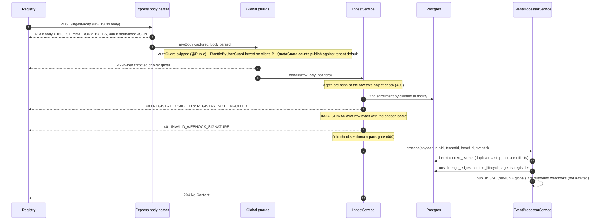

# Ingest Contract

What a registry sends to `POST /ingest/acdp`, and exactly how the control plane
(CP) authenticates, attributes, validates, and stores it. This document is the
**owner** of the ingest facts (HMAC key choice, enrollment, tenant attribution,
quota, Origin handling, authority derivation, dedup); [API.md](./API.md#ingest)
summarises the route and links here.

The **sender's** side — the webhook envelope, event variants, header set and
signature scheme — is defined by the registry in
[acdp-registry-rs `WEBHOOKS.md`](https://github.com/agentcontextdistributionprotocol/acdp-registry-rs/blob/main/docs/WEBHOOKS.md).
This page does not restate it; it documents what the CP does with what arrives.

## Request lifecycle

The checks run in this order. Everything above the HMAC check runs for an
**unauthenticated** request.



| Order | Check | Failure |
|-------|-------|---------|
| 1 | Express JSON body parser (captures the raw bytes, then parses): size limit `INGEST_MAX_BODY_BYTES` (default 1 MiB); malformed JSON | `413 PAYLOAD_TOO_LARGE` / `400 INVALID_PAYLOAD` |
| 2 | Drain gate (only while the process is `closing`) | `503 SERVICE_DRAINING` |
| 3 | `ThrottleByUserGuard` — the route is `@Public()`, so the bucket is the client IP (`normalizeIp`; IPv6 per `/64`; `req.ip` honours `TRUST_PROXY` only) | `429 RATE_LIMITED` |
| 4 | `QuotaGuard` `publish` — see [Quota](#quota-and-rate-limits) | `429 QUOTA_EXCEEDED` + `Retry-After` |
| 5 | Nesting depth > `INGEST_MAX_JSON_DEPTH` (default 64); payload not an object | `400 INVALID_PAYLOAD` |
| 6 | Enrollment lookup for the [claimed authority](#authority-derivation) | `403 REGISTRY_DISABLED` / `403 REGISTRY_NOT_ENROLLED` |
| 7 | HMAC-SHA256 | `401 INVALID_WEBHOOK_SIGNATURE` |
| 8 | `type` present; `agent_id` present when `type` is `context_published`; [domain-pack gate](#domain-pack-context_type-gate); an authority is derivable | `400 INVALID_PAYLOAD` |
| 9 | [Pipeline](./ARCHITECTURE.md#the-pipeline-eventprocessorserviceprocess) (a duplicate stops at its first step) | `500 INTERNAL_ERROR` on a database failure |

Success is always `204 No Content`, for a new event and for a duplicate alike.
Error bodies use the CP error envelope ([API.md](./API.md#error-responses)).

## Authentication — HMAC-SHA256

`x-acdp-signature` carries the hex HMAC-SHA256 of the **raw request bytes**
(`src/ingest/hmac.ts`). The `sha256=` prefix is optional. The comparison is
constant-time; a missing header, non-hex value or wrong length fails.

**Which secret.** If the claimed authority has an enrollment
(`POST /registries/enroll`) with a `webhookSecret`, that secret is used.
Otherwise the global `WEBHOOK_SECRET` is used. The registry side of this is the
per-subscription `webhook.secret` in its
[signature scheme](https://github.com/agentcontextdistributionprotocol/acdp-registry-rs/blob/main/docs/WEBHOOKS.md#signature-scheme).

**Empty secret = no verification.** When the chosen secret is empty (no
enrollment secret and `WEBHOOK_SECRET` unset), every signature is accepted.
Startup refuses an empty `WEBHOOK_SECRET` unless `NODE_ENV=development` (the
default when `NODE_ENV` is unset), so this is a development-only mode. An
enrollment secret is still enforced in development.

**What is signed, and what is not.** Only the body. These headers are read but
are **not** covered by the signature, so anyone replaying a captured delivery
can change them:

| Header | Used for |
|--------|----------|
| `x-run-id` | [Run correlation](#run-correlation) (wins over body `run_id`) |
| `x-tenant-id` | [Tenant attribution](#tenant-attribution) for an unenrolled authority |
| `x-acdp-event-id` | [Dedup key](#idempotency) (wins over body `event_id`) |
| `origin` | [Registry base URL](#registry-base-url) fallback |

**No replay window.** The CP ignores `X-ACDP-Timestamp` and
`X-ACDP-Signature-Timestamped`; it enforces no freshness bound. The only replay
defence is [dedup](#idempotency), which a replayer defeats by sending a fresh
`x-acdp-event-id`. See the registry's note on why the timestamped signature is
opt-in for receivers:
[WEBHOOKS.md — signature scheme](https://github.com/agentcontextdistributionprotocol/acdp-registry-rs/blob/main/docs/WEBHOOKS.md#signature-scheme).

Send `Content-Type: application/json`. The raw bytes the HMAC is computed over
are captured by the body parser for JSON (and form) bodies only; a body under any
other content type is never seen, so it fails the signature check.

### Test signer (Node.js)

For sending test events by hand. Sign the exact bytes you send.

```ts
import { createHmac } from 'node:crypto';

const body = JSON.stringify(event);
const sig = createHmac('sha256', WEBHOOK_SECRET).update(body).digest('hex');

await fetch('http://localhost:3001/ingest/acdp', {
  method: 'POST',
  headers: {
    'Content-Type': 'application/json',
    'x-acdp-signature': `sha256=${sig}`,
    'x-run-id': runId, // optional
  },
  body,
});
```

## Authority derivation

The authority selects the enrollment (and so the secret and tenant) **before**
HMAC, and is stored on the event:

1. body `registry_authority`, else
2. the host part of `ctx_id` when it has the form `acdp://<authority>/<id>`.

The registry's webhook envelope carries no `registry_authority`, so in practice
it comes from `ctx_id`. The claimed authority is untrusted until the HMAC
passes; an attacker can claim any authority but cannot produce its signature.
An event with neither is still looked up as "no enrollment"; after HMAC it is
rejected `400` (`Missing required field: registry_authority (and ctx_id has no
authority)`).

## Registry enrollment

Enrollment (`POST /registries/enroll`, admin-only — [API.md](./API.md#registries))
binds an authority to **one** tenant (the authority is the table's primary key),
with an optional `webhookSecret` and `baseUrl`, and an `enabled` flag.

| Enrollment state | `INGEST_REQUIRE_ENROLLMENT=false` (default) | `INGEST_REQUIRE_ENROLLMENT=true` |
|------------------|---------------------------------------------|----------------------------------|
| enrolled, enabled | accepted; enrollment's tenant + secret | same |
| enrolled, `enabled=false` | `403 REGISTRY_DISABLED` | `403 REGISTRY_DISABLED` |
| not enrolled | accepted; global secret | `403 REGISTRY_NOT_ENROLLED` |

**Current behaviour:** both 403s are returned **before** the HMAC check, so an
unauthenticated caller can learn whether an authority is enrolled or disabled
by the status it gets back (403 versus 401). Each request also costs one
enrollment lookup.

## Tenant attribution

The route is `@Public()`, so the AuthGuard tenant rules (`AUTH_REQUIRE_TENANT`,
`TENANT_HEADER_TRUST`, the reserved-`default` rejection) do **not** apply. The
event's tenant is:

| Case | Tenant |
|------|--------|
| Authority is enrolled | The enrollment's tenant. `X-Tenant-Id` is ignored. |
| Not enrolled, `INGEST_STRICT_TENANT=false` (default) | `X-Tenant-Id` (trimmed), else `default` |
| Not enrolled, `INGEST_STRICT_TENANT=true`, header names a non-`default` tenant | `default`, with a `warn` log (`ingest: unenrolled authority asserted X-Tenant-Id; …`) |

`INGEST_STRICT_TENANT` is recommended for multi-tenant deployments: only a
server-side enrollment can then place events in a non-`default` tenant. Every
write in the pipeline is stamped with this tenant. See [TENANCY.md](./TENANCY.md).

## Quota and rate limits

`/ingest/acdp` carries `@CheckQuota('publish')`. **Current behaviour:**

- `QuotaGuard` runs **before** `IngestService`, so it counts every request that
  reaches it — including ones that later fail HMAC.
- The guard reads `req.tenantId`, which a `@Public()` route never has, so the
  counter is always `default`'s. Only a `default:publish=…` (or `default:*=…`)
  rule in `TENANT_QUOTAS` limits ingest; a rule for the enrollment's tenant
  never applies here.
- Over the limit → `429 QUOTA_EXCEEDED` with `Retry-After`. With no matching
  rule, or the quota store unavailable, the request passes.

The coarse `ThrottleByUserGuard` (`THROTTLE_LIMIT` per `THROTTLE_TTL_MS`) also
applies, keyed on the client IP. Behind a proxy, set `TRUST_PROXY` so every
registry does not share the proxy's bucket. See [POLICY.md](./POLICY.md#quota) for
quota configuration.

## Request limits

| Env var | Default | Effect |
|---------|---------|--------|
| `INGEST_MAX_BODY_BYTES` | `1048576` (1 MiB) | Body-parser limit for the whole app (matches the registry's 1 MB payload ceiling). Larger → `413 PAYLOAD_TOO_LARGE`, before any guard runs. |
| `INGEST_MAX_JSON_DEPTH` | `64` | Nesting-depth scan of the raw text in `IngestService`. Deeper → `400`. |

**Current behaviour:** the Express JSON parser has already parsed the body by
the time `IngestService` runs its depth scan and its own `JSON.parse`, so the
depth cap bounds what the CP processes further, not the first parse; that is
bounded only by the byte limit. `IngestService` also re-checks the byte length
(`400`), but the parser's `413` fires first for any JSON request.

---

## Run correlation

The run id is the `x-run-id` header, else the body's top-level `run_id`. With
neither, the event is stored and broadcast on the global feed but belongs to no
run.

The first event for a `(tenant, run_id)` creates the `runs` row (status
`running`). Its `scenario_id` is the event's scenario (below), or `"unknown"`.
Every later non-duplicate event with that run id — of any type — increments
`contexts_count` and adds its authority to `registries` if new. The scenario is
not updated by later events; `POST /runs/started` fills it in when it is still
`"unknown"`.

## Event shape

The wire format is the registry's
([WEBHOOKS.md](https://github.com/agentcontextdistributionprotocol/acdp-registry-rs/blob/main/docs/WEBHOOKS.md));
lifecycle events are normative in
[RFC-ACDP-0013](https://github.com/agentcontextdistributionprotocol/agentcontextdistributionprotocol/blob/34f14ab2ab454308e94fd6f137ef940db45c72c8/rfcs/RFC-ACDP-0013-lifecycle-events.md)
and the [lifecycle-event-types registry](https://github.com/agentcontextdistributionprotocol/agentcontextdistributionprotocol/blob/34f14ab2ab454308e94fd6f137ef940db45c72c8/registries/lifecycle-event-types.md).
The CP stores the whole payload in `context_events.raw_payload` and reads only
these fields:

| Field | Required | Used for |
|-------|----------|----------|
| `type` | **yes** | `context_published`, `context_retrieved`, `context_retracted`, `context_republished`, `search_executed`. Lineage edges only on `context_published`; retract/republish drive `context_lifecycle`. |
| `agent_id` | `context_published` only | Producer DID, stored opaque. Retrieve/search events are agent-less by design. Populates `agents` when present. |
| `registry_authority` | derived if absent | See [Authority derivation](#authority-derivation). Populates `registries`. |
| `ctx_id` | no | `acdp://<authority>/<id>`. Authority fallback, lineage edge target, part of the content fingerprint. |
| `event_id` | no | Registry-minted delivery id; dedup key when `X-ACDP-Event-Id` is absent. |
| `registry_base_url` | no | Preferred [registry base URL](#registry-base-url). |
| `lineage_id` | no | Stored; used by the lifecycle projection. |
| `context_type` | no | Stored; subject to the [domain-pack gate](#domain-pack-context_type-gate). |
| `visibility`, `version` | no | Stored. `version` is part of the content fingerprint. |
| `derived_from` | no | Array of `ctx_id`s; each becomes a lineage edge on `context_published`. |
| `metadata.scenario_id`, `scenario_id` | no | Run scenario. **`metadata.scenario_id` wins** over the top-level field. |
| `run_id` | no | See [Run correlation](#run-correlation). |
| `created_at`, `at` | no | Event timestamp: `created_at`, else `at` (the RFC-ACDP-0013 lifecycle timestamp), else arrival time. |
| `actor`, `reason` | no | Lifted into `context_lifecycle` and the SSE event on retract/republish. |
| `key_fingerprint` | no | Lifted into the `key_fingerprint` column (string values only); SSE `keyFingerprint`. |
| `registry_receipt` | no | Kept in `raw_payload`; an object here sets `receipt_present`, and the receipt-audit sweep checks it later. |

Unknown fields are kept in `raw_payload` and returned by
`GET /runs/:runId/events`.

### Minimal example

```json
{
  "type":         "context_published",
  "event_id":     "6f1c2c1e-4b8a-4d3f-9d2e-0b7f3a1c9e55",
  "agent_id":     "did:web:scoring-agent.example",
  "ctx_id":       "acdp://registry-east.example/01F3…",
  "context_type": "analysis",
  "derived_from": ["acdp://registry-east.example/01F2…"],
  "metadata":     { "scenario_id": "credit-review-v1" },
  "created_at":   "2026-05-24T12:00:00Z"
}
```

### Registry base URL

The federation proxy (`GET /contexts/*ctxId`) needs a base URL for each
authority. The pipeline's registry upsert takes the first non-empty value of:

1. body `registry_base_url`,
2. the request's `Origin` header,
3. the enrollment's `baseUrl`.

A non-empty value overwrites the stored one; an empty one leaves it unchanged.
`Origin` is unsigned, so a replayed delivery can repoint the stored URL; the
federation proxy's SSRF gate still applies to whatever is stored.

### Domain-pack `context_type` gate

Domain packs are compiled in (`src/domain-packs/known-packs.ts`; today only
`finance`) and selected at boot by `DOMAIN_PACKS`. An unknown name fails
startup. `GET /domain-packs` lists the active packs; there is no runtime reload.

- **No packs configured** → no gate; every `context_type` is accepted.
- **Always accepted:** the base types `data_snapshot`, `analysis`,
  `prediction`, `alert`
  ([context-types registry](https://github.com/agentcontextdistributionprotocol/agentcontextdistributionprotocol/blob/34f14ab2ab454308e94fd6f137ef940db45c72c8/registries/context-types.md)),
  plus `key-revocation` and its interim spelling `acdp:key-revocation`
  ([RFC-ACDP-0014](https://github.com/agentcontextdistributionprotocol/agentcontextdistributionprotocol/blob/34f14ab2ab454308e94fd6f137ef940db45c72c8/rfcs/RFC-ACDP-0014-key-revocation.md)
  §4/§10), both from `src/contracts/revocation.ts`. An event with no
  `context_type` is also accepted.
- **Anything else** must be declared by an active pack, or it is rejected
  `400`, logged at `warn`, and counted on
  `acdp_ingest_rejected_total{reason="pack_gate"}`.

> **Operator note — silent divergence.** The registry treats a `4xx` as
> permanent and does not retry it (it logs `webhook_4xx`), so a pack-gated
> publish is stored by the registry but never by the CP. Watch the metric
> above, and either declare the type in a pack or leave `DOMAIN_PACKS` unset.

---

## What happens after ingest

`EventProcessorService.process` runs the seven-step pipeline described in
[ARCHITECTURE.md](./ARCHITECTURE.md#the-pipeline-eventprocessorserviceprocess):
persist (with dedup), run upsert, lineage edges / lifecycle projection, agent
upsert, registry upsert, SSE publish, outbound webhooks. The `204` is sent after
SSE publish; outbound webhook delivery is not awaited.

## Idempotency

Each event gets a dedup key, stored in `context_events.fingerprint` under a
partial unique index on `(tenant_id, fingerprint)`:

1. `X-ACDP-Event-Id` header (trimmed), else body `event_id` → stored as
   `evt:<id>`;
2. otherwise a content fingerprint: the first 32 hex characters of
   `sha256("type:ctx_id:agent_id:created_at:run_id:version")`, where `run_id`
   is the resolved run id (header or body). The `evt:` prefix keeps the two
   forms from colliding.

A duplicate insert is skipped and the request still returns `204`, with **no**
side effects: no run increment, lineage edge, SSE event or outbound webhook.
Lineage edges are also unique on `(tenant_id, from_ctx_id, to_ctx_id)`.

Limits of this dedup (current behaviour):

- It is per tenant. The same event attributed to two tenants is stored twice.
- `X-ACDP-Event-Id` is unsigned; a different value is a different event.
- Once retention purges a `context_events` row, a replay of that event is new.
- **Lifecycle events with the header stripped.** The body `event_id` is a
  per-delivery id; the actor-minted `lifecycle_event_id` is provenance and never
  a dedup key. A producer's byte-identical resubmit of a signed retract or
  republish therefore arrives as two deliveries with different ids and is
  stored twice. The lifecycle projection is unaffected (re-applying a transition
  is a no-op). See the registry's
  [two-ids note](https://github.com/agentcontextdistributionprotocol/acdp-registry-rs/blob/main/docs/WEBHOOKS.md#two-ids-and-why-they-have-different-names).

## Related endpoints

- `GET /ingest/health` — `@Public()`, returns `{ "ok": true }`; for testing a
  registry's webhook configuration. Throttled like any other route.
- `POST /runs/started` and `POST /runs/:runId/complete` use the same HMAC
  header, but always with the global `WEBHOOK_SECRET` (never an enrollment
  secret). They take `X-Tenant-Id` as given — `INGEST_STRICT_TENANT` does not
  apply — except that an explicit `default` is rejected `403 TENANT_RESERVED`.
  See [API.md](./API.md#runs).
