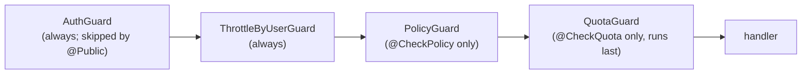

# Policy & Quota

Two of the four global guards are **decorator-gated**: they no-op unless a handler
carries the matching decorator. `PolicyGuard` authorizes *what* a caller may do;
`QuotaGuard` rate-limits *how often* per tenant. Both run after `AuthGuard` (so
`subjectDid`, `scopes`, and `tenantId` are populated) and `ThrottleByUserGuard`
(registration order in `src/app.module.ts`).



`QuotaGuard` runs **last** by design — a request denied by auth, throttle or policy
never burns a quota increment. Anything checked *inside* the handler is a different
story: see [ingest](#which-handlers-are-gated-1), where the HMAC is verified after the
quota has already been counted.

---

## Policy

`PolicyGuard` (`src/policy/policy.guard.ts`) reads `@CheckPolicy(action)` from the
handler. With no decorator it returns `true` immediately (the handler is
unconditionally allowed, having already passed auth). With a decorator it builds a
`PolicyRequest` and asks the `PolicyDecider` registered by `PolicyModule`.

### `PolicyRequest`

```ts
{
  subjectDid: string;            // see below
  action: PolicyAction;          // 'context.publish' | 'context.retrieve' | 'context.list'
                                 // | 'capability.declare' | 'run.start' | 'run.read'
  resourceId: string;            // route param ctxId (segments joined with '/'), else runId, else did; '' otherwise
  resourceVisibility?: 'public' | 'restricted' | 'private';   // never set by PolicyGuard today
  resourceAudience?: string[];   // never set by PolicyGuard today
  scopes: string[];              // union of the JWT scope / scopes / scp claims; [] for API keys
  tenantId?: string;             // the AuthGuard-pinned tenant ('default' when none)
  issuer?: string;               // verified JWT iss ('' for API-key callers)
  federated?: boolean;           // true = token from a TRUSTED_ISSUERS entry
}
```

What actually reaches the decider (current behaviour):

- **`subjectDid`** is `req.actorDid` (the JWT `sub`) when set, else `req.actorId`. For an
  API-key caller that is the key's first 8 characters + `...` — not a DID, but non-empty,
  so the caller counts as authenticated. It is `''` only in the dev bypass (empty
  `AUTH_API_KEYS`, see [AUTH.md](./AUTH.md#api-key-path)), because every `@CheckPolicy`
  route is guarded.
- **`resourceVisibility` / `resourceAudience` are never populated**: the guard runs before
  the resource is loaded. The OPA backend therefore always receives
  `"resource_visibility": null` and `"resource_audience": []`.

The decider returns `allow`, `deny` (with a `code` + `reason`), or
`indeterminate`. `PolicyGuard` maps `allow → continue`, and both `deny` and
`indeterminate` → `403` (each logged at warn):

```json
{
  "statusCode": 403,
  "errorCode": "POLICY_DENIED",
  "message": "policy denied",
  "code": "visibility",
  "reason": "…",
  "metadata": { "code": "visibility", "reason": "…" },
  "error": {
    "code": "POLICY_DENIED",
    "message": "policy denied",
    "details": { "code": "visibility", "reason": "…" }
  }
}
```

`errorCode` (and `error.code`) is always `POLICY_DENIED` — the control-plane
error category. The top-level `code` is the decider's rule id, one of
`visibility`, `audience`, `scope`, `tenant_mismatch`, `unauthenticated`, or
`indeterminate` (then `message` is `"policy indeterminate"`; the decider could not
decide — retrying may help once OPA is reachable). The two are different axes and never
overwrite each other.

### Backends (`POLICY_BACKEND`)

| Backend | Selected by | Behavior |
|---------|-------------|----------|
| `static` (default) | `POLICY_BACKEND=static` (case-insensitive; any value other than `static`/`opa` fails startup) | In-process rules (`StaticRulesPolicyDecider`). |
| `opa` | `POLICY_BACKEND=opa` | Delegates to an OPA sidecar over HTTP. |

Both are wrapped by a **caching decider** (`CachingPolicyDecider`) with a **fixed** 5 s
TTL and 10 000-entry LRU bound — hard-coded in `src/policy/policy.module.ts`, no env
knob. The cache key includes sorted scopes + audience, plus the issuer and the federated
flag (so a cached `allow` for a local token is never served to a federated one). Only
`allow`/`deny` are cached — `indeterminate` is never cached, so coverage gaps reappear
on every request rather than sticking. The cache is per process.

#### Static rules (`StaticRulesPolicyDecider`)

The decider (`src/policy/static-rules-policy.decider.ts`) implements this tree:

1. Empty subject: allow only `context.retrieve` of a `public` resource and
   `context.list`; everything else → deny `unauthenticated`.
2. Tenant gate: if a resource-tenant lookup is configured and both tenants are known,
   a mismatch → deny `tenant_mismatch`.
3. Per-action required scopes: if configured for the action, every one must be present
   → else deny `scope`.
4. `context.retrieve`: `public` allow; `private` deny `visibility`; `restricted` allow
   only if the subject is in the audience (`audience`); **no visibility supplied → allow**.
5. Every other action → allow.

**What the shipped wiring makes effective (current behaviour).** `PolicyModule`
constructs it as `new StaticRulesPolicyDecider({})` — no required scopes and no
resource-tenant lookup, and there is no env var to supply either — and `PolicyGuard`
never supplies visibility. So steps 2 and 3, and the `private`/`restricted` branches of
step 4, never fire. In practice the static backend is just:

| Subject | Result on every `@CheckPolicy` route |
|---------|---------------------------------------|
| non-empty (any JWT or API key) | allow |
| empty (dev bypass only) | deny `unauthenticated` (`context.retrieve` too: visibility is unknown, so it is not `public`) |

Tenant isolation is enforced by the repositories ([TENANCY.md](./TENANCY.md)), and
context visibility by the upstream registry (the federation proxy forwards no caller
credentials), not by this decider. The decider ignores `issuer`/`federated`.

#### OPA backend

`OpaPolicyDecider` (`src/policy/opa-policy.decider.ts`) sends
`POST <OPA_URL>/v1/data/<path>/decision` with body `{ "input": … }`, where `<path>` is
`OPA_PACKAGE_PATH` with every `/` replaced by `.` and leading/trailing dots stripped
(the rule name `decision` is fixed). With the defaults (`OPA_URL=http://localhost:8181`,
`OPA_PACKAGE_PATH=acdp/policy/v1`) the request goes to:

```
POST <OPA_URL>/v1/data/acdp.policy.v1/decision
```

That is the exact URL the code builds. OPA's own Data API documentation addresses
packages with **slash**-separated path segments (`/v1/data/acdp/policy/v1/decision`);
this dotted form has **not** been verified against a live OPA server. If OPA answers
it with an empty result, every decision becomes `indeterminate` → `403`. Check it in
your environment before relying on the OPA backend.

Input:

```json
{
  "subject_did": "…",
  "action": "context.retrieve",
  "resource_id": "…",
  "resource_visibility": null,
  "resource_audience": [],
  "scopes": ["publish"],
  "tenant_id": "tenant-a",
  "issuer": "cp.example.com",
  "federated": false
}
```

`resource_visibility` is typed `"public" | "restricted" | "private" | null`, but
`PolicyGuard` always sends `null` (see above). `issuer` is the verified JWT `iss` (`""`
for API-key callers); `federated` is `true` when the token came from a `TRUSTED_ISSUERS`
entry. A site policy can use them, e.g. (commented example — not part of the shipped
corpus):

```rego
# deny capability.declare for federated principals
# decision := {"allow": false, "deny_code": "scope", "deny_reason": "federated principal"} if {
#   input.action == "capability.declare"
#   input.federated
# }
```

> **Scope of this control.** `PolicyGuard` runs only on `@CheckPolicy` handlers (7 today).
> `POST /webhooks` is **not** one of them, so a policy rule cannot restrict it; use the
> per-issuer `read_only` flag (see [AUTH.md](./AUTH.md#relation-to-rfc-acdp-0008-62-bearer_jwt))
> for CP-local writes by federated tokens.

Expected response: `{ "result": { "allow": true } }` or
`{ "result": { "allow": false, "deny_code": "…", "deny_reason": "…" } }` or
`{ "result": { "indeterminate": true, "note": "…" } }`. Interpretation
(`interpretOpa`):

- `deny_code` must be one of `visibility`, `audience`, `scope`, `tenant_mismatch`,
  `unauthenticated`; a missing or **unknown** `deny_code` is reported as `visibility`
  (so a custom code like `"policy"` surfaces to the client as `code: "visibility"`).
- A missing `result` (OPA's answer for an undefined rule) or a result with neither
  `allow` nor `indeterminate: true` → `indeterminate`.
- Timeout (`OPA_TIMEOUT_MS`, default 1500 ms), non-2xx, transport error or non-JSON body →
  `indeterminate` (→ `403`) **unless** `OPA_FAIL_OPEN=true`, which returns `allow`.

A reference Rego policy + tests live under [`docs/policies/`](./policies/). It mirrors the
static decider's tree, **not** its effective behaviour: because the guard always sends
`resource_visibility: null`, an authenticated `context.retrieve` matches no rule in it and
is `indeterminate` → `403`, where the static backend allows. Add a rule for that case
before switching `GET /contexts/*` to OPA. (`opa test docs/policies/` is not run in CI.)

### Which handlers are gated

`src/policy/controller-coverage.spec.ts` pins which controller methods must carry
a policy decorator, so coverage gaps fail CI. The live set (7):

| Action | Handler(s) |
|--------|-----------|
| `context.retrieve` | `GET /contexts/*ctxId` |
| `capability.declare` | `POST /capabilities` |
| `run.read` | `GET /runs`, `GET /runs/:runId`, `GET /runs/:runId/lineage`, `GET /runs/:runId/events`, `GET /runs/:runId/events/stream` |

`context.publish`, `context.list` and `run.start` exist in the `PolicyAction` union but
no handler uses them (`POST /runs/started` and `POST /runs/:runId/complete` are
`@Public()` + HMAC, no policy gate).

---

## Quota

`QuotaGuard` (`src/quota/quota.guard.ts`) reads `@CheckQuota(action)` and enforces
per-tenant, per-action **windowed counters** (fixed window starting at the first hit).
Lookup chain (cheap → expensive); any miss passes through:

1. No `@CheckQuota` decorator → pass.
2. Tenant = `req.tenantId`, or `default` when none was pinned (always the case on a
   `@Public()` route).
3. No limit configured for `(tenant, action)` (nor a `*` wildcard for that tenant) → pass.
4. Increment `acdp:quota:<tenant>:<action>`; if the store is unavailable it **fails
   open** (allows, warning logged by the store).
5. Count over the limit → `429`.

### Store (`QuotaStore`)

| Store | When | Notes |
|-------|------|-------|
| In-memory (default) | otherwise | `Map` of `{count, expiresAt}`; per process, lost on restart. |
| Redis | `REDIS_URL` set **and** `TENANT_QUOTAS` non-empty | Atomic `INCR` + `EXPIRE NX` Lua script; window shared across replicas. Falls back to in-memory if `ioredis` cannot be loaded. |

Setting `REDIS_URL` without `TENANT_QUOTAS` opens no quota connection
(`src/quota/quota.module.ts`). The Redis store fails open on transport error (it returns
a sentinel that the guard treats as "no signal").

### Config — `TENANT_QUOTAS`

```
TENANT_QUOTAS=tenant-a:publish=100/min,capability.declare=10/min;tenant-b:publish=500/min
```

- Tenants separated by `;`; within a tenant, `tenantId:action=count/window[,…]`.
- `window` ∈ `sec` | `min` | `hour`; `count` a positive integer.
- `action` ∈ `publish` | `run.start` | `capability.declare` | `token.issue` | `*`
  (wildcard — applies to any action not explicitly listed for that tenant).
- **Current behaviour:** `run.start` and `token.issue` are accepted by the parser but
  **no handler carries them**, so a limit on either is never enforced. Only `publish`
  and `capability.declare` (and a `*` wildcard, through those two) take effect.
- Parsing is strict: a malformed entry throws `QuotaConfigError` at boot.

### 429 response

```json
{
  "statusCode": 429,
  "errorCode": "QUOTA_EXCEEDED",
  "message": "quota exceeded",
  "code": "rate_limited",
  "tenantId": "tenant-a",
  "action": "publish",
  "limit": 100,
  "windowSeconds": 60,
  "retryAfterSeconds": 42,
  "metadata": { "code": "rate_limited", "tenantId": "tenant-a", "action": "publish", "limit": 100, "windowSeconds": 60, "retryAfterSeconds": 42 },
  "error": { "code": "QUOTA_EXCEEDED", "message": "quota exceeded", "details": { "…": "same as metadata" } }
}
```
plus a `Retry-After: 42` header (the window's remaining seconds, minimum 1). The legacy
top-level fields are kept for existing clients. `QUOTA_EXCEEDED` is distinct from
`RATE_LIMITED`, the coarse per-principal throttle (`THROTTLE_LIMIT`), which is not
action-scoped.

### Which handlers are gated

| Action | Handler | Tenant counted |
|--------|---------|----------------|
| `publish` | `POST /ingest/acdp` | **always `default`** (see below) |
| `capability.declare` | `POST /capabilities` | the caller's tenant |

**Ingest quota — current behaviour.** `/ingest/acdp` is `@Public()`, so `AuthGuard`
pins no tenant and `QuotaGuard` counts every webhook against
`acdp:quota:default:publish`, whatever tenant the event is later attributed to (by
enrollment or `X-Tenant-Id`, which are resolved inside the handler). A `publish` limit
for any tenant other than `default` therefore never applies, and a `default` limit (or a
`default` `*` wildcard) caps **all** ingest traffic together. Because the guard runs
before the handler verifies the HMAC, unsigned or badly signed requests also consume
that budget. See [INGEST.md](./INGEST.md) for the ingest request order.

---

## Relationship to the coarse throttle

`ThrottleByUserGuard` (`@nestjs/throttler`, always on) is a *coarse* per-principal
request limiter (`THROTTLE_LIMIT` per `THROTTLE_TTL_MS`, with a tighter 20/min override
on `/auth/challenge` + `/auth/token`). Its bucket keys — API-key 8-character prefix,
JWT `sub`, or the client IP (`TRUST_PROXY`, IPv6 `/64`) on `@Public()` routes — are
documented in [AUTH.md](./AUTH.md#request-throttling-throttlebyuserguard). `QuotaGuard`
is the *business* quota: per-tenant, per-action, and only where opted in. They are
independent layers.
